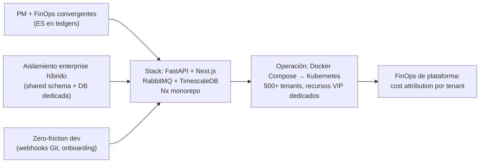

# SaaS PM+FinOps

> Plataforma **SaaS B2B multi-tenant** de gestión de proyectos de TI con convergencia nativa entre **gestión de proyectos (PM)** y **operaciones financieras (FinOps)**.

[](docs/architecture/00-Executive-Summary.md)
[](docs/architecture/09-Technology-Stack-Matrix.md)
[](docs/architecture/08-Frontend-DesignSystem-Landing.md)
[](docs/architecture/10-Infrastructure-Docker-K8s.md)
[](docs/architecture/README.md)

---

## ✨ Qué es

Una plataforma donde **cada hora trabajada es un evento financiero de primera clase**. El motor FinOps convierte la evidencia del trabajo (timers, entradas manuales y *commits* de Git) en **costo, margen y riesgo de SLA en tiempo real**, integrando de forma nativa lo que hoy vive fragmentado entre Jira/Asana/ClickUp y una hoja de cálculo.

> **Estado actual:** este repositorio contiene la **documentación de arquitectura (SAD)** de referencia. El código es ilustrativo dentro del SAD; aún **no hay una implementación ejecutable**. Es la base técnica para que el equipo de ingeniería construya el producto.

## 🏛️ Los tres pilares

| Pilar | Descripción |
|---|---|
| **PM + FinOps convergentes** | Margen y SLA derivados de *ledgers* inmutables (Event Sourcing en lo financiero); CRUD ágil en el *core* de PM. |
| **Aislamiento enterprise híbrido** | *Schema* compartido con `tenant_id` (Starter/Growth) + **base de datos dedicada** (Enterprise/VIP), con recursos VIP físicamente aislados en K8s. |
| **Zero-friction para devs** | Registro de horas vía *webhooks* de Git (`Resolves #102 [Time: 2h]`) y onboarding de tenant en caliente, sin abrir la UI. |

## 🧱 Stack tecnológico (resumen)

| Capa | Tecnología |
|---|---|
| **Backend** | FastAPI · Python 3.12 · Pydantic v2 · SQLAlchemy 2.0 async + asyncpg · Alembic |
| **Mensajería** | RabbitMQ (DLX, colas prioritarias) · FastStream (AsyncAPI) |
| **Datos** | PostgreSQL 16 · TimescaleDB · Redis/Valkey · OpenSearch · MinIO |
| **Frontend** | Next.js (App Router) · TypeScript · Tailwind · shadcn/ui · Framer Motion · TanStack Query · Zustand |
| **Observabilidad** | OpenTelemetry → Prometheus + Loki + Tempo + Grafana |
| **Billing** | OpenMeter (metering) + Stripe Billing |
| **Infra** | Docker Compose → Kubernetes · Traefik · Vault |
| **Tooling** | Monorepo Nx + `@nxlv/python` con codegen de contratos OpenAPI/AsyncAPI |

👉 Justificación completa y alternativas descartadas en [`docs/architecture/09-Technology-Stack-Matrix.md`](docs/architecture/09-Technology-Stack-Matrix.md).

## 📚 Documentación de arquitectura (SAD)

El SAD es **modular**: un archivo por dominio + índice + apéndice de ADRs + diagramas, redactado en **español técnico** (código/identificadores en inglés).

**Punto de entrada recomendado:** [`docs/architecture/README.md`](docs/architecture/README.md) — índice, glosario y mapa bidireccional especificación ↔ archivo.



### Estructura del repositorio

```
project-saas/
├── README.md                         ← este archivo (portada del repo)
├── .gitignore
└── docs/
    └── architecture/                 ← SAD modular
        ├── README.md                 índice + glosario + mapa spec↔archivo
        ├── 00-Executive-Summary.md … 16-Roadmap-FinOps-Risks.md
        ├── ADR-Records.md            14 ADRs (Nygard, ADR-0001…ADR-0014)
        └── diagrams/
            ├── c4-context.mmd        C4 Nivel 1 (Contexto)
            ├── c4-container.mmd      C4 Nivel 2 (Contenedores)
            └── erd-core.mmd          ERD del dominio core
```

### Lectura rápida por interés

| Si te interesa… | Lee |
|---|---|
| La visión y el porqué | [`01-Product-Vision-Differentiation.md`](docs/architecture/01-Product-Vision-Differentiation.md) |
| Cómo se aíslan los tenants | [`02-Multi-Tenancy-Data-Strategy.md`](docs/architecture/02-Multi-Tenancy-Data-Strategy.md) |
| Identidad, RBAC y auditoría | [`03-Identity-Security-RBAC.md`](docs/architecture/03-Identity-Security-RBAC.md) |
| El dominio y CQRS/ES | [`04-Domain-Design-DDD-CQRS.md`](docs/architecture/04-Domain-Design-DDD-CQRS.md) |
| El corazón financiero | [`06-FinOps-TimeTracking-Engine.md`](docs/architecture/06-FinOps-TimeTracking-Engine.md) |
| Infraestructura y despliegue | [`10-Infrastructure-Docker-K8s.md`](docs/architecture/10-Infrastructure-Docker-K8s.md) |
| Billing, metering y tiers | [`14-Billing-Metering-Tiers.md`](docs/architecture/14-Billing-Metering-Tiers.md) |
| Las decisiones (ADRs) | [`ADR-Records.md`](docs/architecture/ADR-Records.md) |

## 🔐 Seguridad y privacidad

La arquitectura contempla RBAC/ABAC con 9 roles, *audit ledger* inmutable (hash chaining + export WORM a MinIO), cifrado TLS 1.3 / AES-256, rate-limiting por tier y un *pipeline* DevSecOps (SAST, DAST, SCA, escaneo de imágenes). Detalle en [`13-Security-DevSecOps.md`](docs/architecture/13-Security-DevSecOps.md) y [`03-Identity-Security-RBAC.md`](docs/architecture/03-Identity-Security-RBAC.md).

## 🗺️ Roadmap

1. **MVP** — landing + *core* PM en Docker Compose.
2. **Multi-tenant estable + metering** (Starter/Enterprise).
3. **Enterprise + VIP en K8s** — recursos dedicados, analítica predictiva de SLA.
4. **HA multi-región** — activa-pasiva, DR probado, RTO/RPO objetivos.

Detalle y FinOps de plataforma en [`16-Roadmap-FinOps-Risks.md`](docs/architecture/16-Roadmap-FinOps-Risks.md).

## 📄 Licencia

Por definir. Mientras tanto, todos los derechos reservados. Este repositorio contiene documentación de arquitectura con decisiones de negocio y estrategia; el uso o reproducción requiere autorización expresa.

---

<sub>Documentación en español técnico · código e identificadores en inglés · SAD v1.0</sub>
