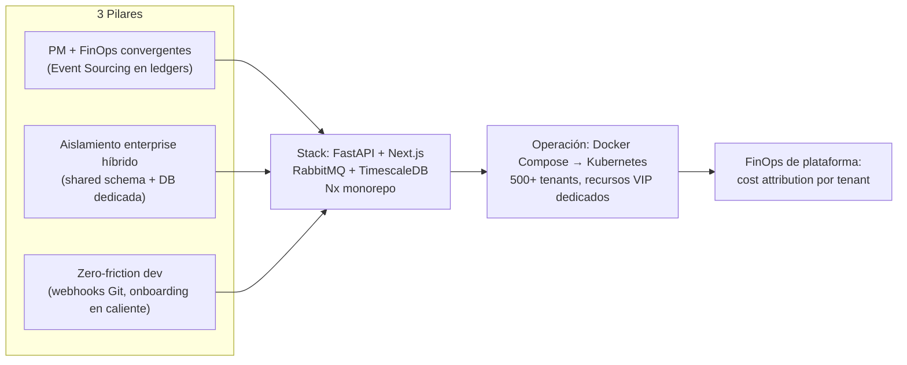

# 00 — Resumen Ejecutivo

## 1. Visión

Construir una plataforma **SaaS B2B multi-tenant** de gestión de proyectos de TI que sea la primera en su categoría en integrar **de forma nativa** la gestión de proyectos (PM) con las **operaciones financieras (FinOps)**. El objetivo es que cada organización cliente (tenant) conozca, en tiempo real, el **costo real** y el **margen** de cada tarea, contrato y SLA, y que esa información provenga de **evidencia verificable** (commits, PRs, timers) en lugar de planillas manuales.

La plataforma arranca operando con **Docker Compose** (entorno de desarrollo y primeros clientes) y está diseñada desde el primer día para ser **100 % Cloud-Native** y migrar a **Kubernetes**, con capacidad de escalar a **500+ tenants y miles de usuarios concurrentes**, ofreciendo aislamiento de grado *enterprise* para los tenants más exigentes.

## 2. Los tres pilares

### Pilar 1 — PM + FinOps convergentes
No se trata de "Jira + una planilla de costos". El motor de dominio financiero es de **primera clase**: cada hora registrada (manual, por timer en tiempo real, o automática vía webhook de Git) se convierte inmediatamente en un asiento en el **ledger financiero**, impactando el margen del contrato y la probabilidad de cumplimiento de SLA. La arquitectura aplica **Event Sourcing en los ledgers** (financiero, auditoría, metering) para garantizar trazabilidad e inmutabilidad, mientras el *core* de PM permanece en CRUD ágil. (Ver `04`, `06`, `14`; ADR-0006.)

### Pilar 2 — Aislamiento *enterprise* híbrido
Una sola plataforma atiende desde un *startup* en tier **Starter** hasta una empresa regulada en tier **VIP**, sin cambiar de producto. La estrategia de multi-tenancy es **híbrida** (ADR-0005): *schema* compartido con discriminador `tenant_id` para Starter/Growth, y **base de datos física dedicada** para Enterprise/VIP. En Kubernetes, los tenants VIP reciben **recursos dedicados**: nodos aislados por *Node Affinity/Taint*, *workers* exclusivos, réplicas de lectura, colas prioritarias y retención de logs extendida (ADR-0014). (Ver `02`, `10`.)

### Pilar 3 — *Zero-friction* para desarrolladores
El desarrollador **no debe abrir la UI** para registrar su trabajo. La plataforma captura la evidencia del ciclo de vida del código —*commits* y *pull requests* de GitHub/GitLab con *tags* como `Resolves #102 [Time: 2h]`— la procesa de forma asíncrona a través de colas, y la transforma en registros de tiempo verificables y en eventos de metering. La experiencia de onboarding también es sin fricción: captura de *lead* → *provisioning* de tenant en caliente → recursos en base de datos → email de bienvenida asíncrono. (Ver `06`, `08`.)

## 3. Principios arquitectónicos

| # | Principio | Implicación de diseño |
|---|---|---|
| P1 | **Datos como fuente de la verdad financiera** | Los ledgers son *append-only*; el margen y el SLA se **derivan** de eventos, no se sobrescriben. |
| P2 | **Aislamiento proporcional al tier** | El costo de aislamiento se paga solo cuando el contrato lo justifica (híbrido). |
| P3 | **Mensajería como columna vertebral** | Toda comunicación inter-servicio de larga duración es asíncrona vía **RabbitMQ**; no hay acoplamiento sincrónico para flujos de negocio. |
| P4 | **Contratos antes que código** | OpenAPI (HTTP) y AsyncAPI (eventos) son generados y consumidos como *clientes tipados* en el monorepo. |
| P5 | **Observabilidad obligatoria** | Cada request y cada evento llevan `trace_id`/`tenant_id`; nada opera "a ciegas". |
| P6 | **Seguridad por defecto** | Defensa en profundidad, mínimo privilegio, cifrado en tránsito y reposo, y *pipeline* DevSecOps continuo. |
| P7 | **Pragmatismo sobre dogma** | DDD/Clean donde el dominio lo paga (finanzas, identidad); CRUD simple donde basta (catálogos de PM). |
| P8 | **Diseño para el desastre** | Backups PITR, RTO/RPO explícitos y *failover* son parte del diseño, no un añadido posterior. |

## 4. Audiencia

- **Equipo de ingeniería (backend/frontend/SRE):** referencia primaria para implementar, operar y evolucionar la plataforma.
- **Líderes técnicos y arquitectos:** contexto de las decisiones (ADRs) y sus *trade-offs*.
- **Producto y comercial:** entendimiento de capacidades, tiers y diferenciación.
- **Seguridad y cumplimiento:** trazabilidad de controles (RBAC, audit ledger, cifrado).

## 5. Alcance (scope)

### Dentro del alcance
- Arquitectura de referencia completa de una plataforma SaaS PM+FinOps multi-tenant.
- Definición de stack, modelo de datos, dominios, eventos, infraestructura y seguridad.
- Matriz de tiers (Starter/Growth, Enterprise, VIP/Custom) con activación de recursos VIP.
- *Pipeline* de metering y billing (OpenMeter + Stripe).
- Roadmap en 4 fases y modelo FinOps de plataforma (imputación de costos por tenant).

### Fuera del alcance (no-scope)
- **Implementación ejecutable.** Este SAD es **documentación**: el código es ilustrativo. No se entrega un repositorio funcional ni se ejecutan comandos mutantes.
- **Negociación comercial detallada** (precios finales, descuentos por contrato): se dan valores de referencia para la matriz de tiers.
- **Cumplimiento legal específico por jurisdicción** (p. ej. redacción de cláusulas DPA): se abordan controles técnicos SOC2/GDPR, no asesoría legal.
- **Migración de datos desde tools legacy** (Jira/Asana/ClickUp): se diferencia del producto, pero los importadores están fuera de este documento.

## 6. Cómo encaja todo (vista de una página)

## 7. Navegación al resto del SAD

- Para entender **qué** se construye y **por qué** es diferente: `01`.
- Para entender **cómo** se aíslan los tenants y los datos: `02`.
- Para el **diseño de dominio** y el equilibrio CQRS/ES: `04`, seguido de `05` (eventos).
- Para el **corazón financiero**: `06` (FinOps/timer) y `07` (predictivo/SLA).
- Para **infraestructura y operación**: `10`, `11`, `12`, `13`.
- Para el **modelo de negocio técnico** (tiers, billing): `14`.
- Para **dónde vive el código** y cómo se organiza: `15`.
- Para el **plan de evolución y riesgos**: `16`.

Las **14 decisiones** que sustentan todo lo anterior están en `ADR-Records.md`.
