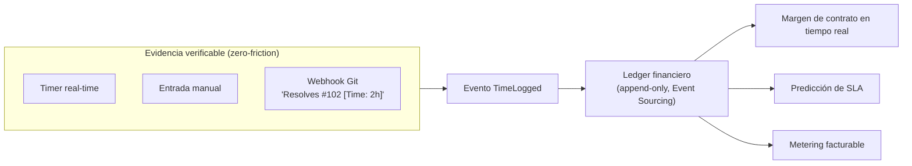

# 01 — Visión de Producto y Diferenciación

> Especificación original: **§1**. Relacionado: `06` (FinOps/timer), `14` (billing/tiers), `08` (landing/ROI).

## 1. El problema

Las herramientas de gestión de proyectos de TI (Jira, Asana, ClickUp) resuelven muy bien el **"qué"** y el **"cuándo"** (tareas, *sprints*, *roadmaps*), pero tratan el **"cuánto cuesta"** como una ocurrencia tardía: el costo real se reconstruye al final del mes en una hoja de cálculo, desconectado de la evidencia del trabajo, y siempre llega demasiado tarde para corregir el rumbo. El resultado es predecible: **márgenes erosionados, SLAs incumplidos por sorpresa y facturación que no refleja el consumo real** de la infraestructura.

Paralelamente, los equipos SaaS que venden estas plataformas sufren el espejo del mismo problema: **no saben cuánto les cuesta realmente cada tenant** (ruido de vecindario, *noisy neighbor*, uso intensivo de cómputo, almacenamiento), lo que destruye rentabilidad en cuentas VIP mal dimensionadas.

## 2. La propuesta: PM + FinOps convergentes desde el núcleo

La plataforma trata **cada hora trabajada como un evento financiero de primera clase**. No es "PM + un módulo de costos": el **Financial Engine** es un dominio *bounded context* peer del *Project Execution*, y ambos convergen en un **ledger inmutable**. Esto habilita tres capacidades que la competencia ofrece de forma fragmentada o inexistente:

1. **Margen en tiempo real por contrato/tarea**, derivado de horas×costo por rol.
2. **Alerta temprana de quiebre de SLA**, comparando *velocity* histórica vs. capacidad vs. *burn rate* presupuestario.
3. **Cost attribution por tenant** que cierra el bucle FinOps también para *nosotros* como operadores del SaaS.

## 3. Diferenciación frente a la competencia

| Dimensión | Jira | Asana | ClickUp | **Esta plataforma** |
|---|---|---|---|---|
| Núcleo | Gestión de issues | Gestión de tareas | PM todo-en-uno | **PM + FinOps convergentes** |
| Costo/margen en tiempo real | ❌ (add-ons, manual) | ❌ | ❌ | ✅ Derivado de eventos |
| Captura de evidencia (commits/PRs) | Add-ons de terceros | Mínimo | Mínimo | **Nativa, asíncrona, zero-friction** |
| Predictivo de SLA | ❌ | ❌ | ❌ | ✅ Probabilidad de quiebre |
| Aislamiento enterprise real | Por plan, limitado | Por plan | Por plan | **Híbrido: DB dedicada para VIP** |
| Facturación por consumo medido | Planes fijos | Planes fijos | Planes fijos | **Metering → OpenMeter + Stripe** |

### El "motor orientado a eventos sin *bloatware*"
Los competidores acumulan décadas de deuda funcional: docenas de campos, *workflows* opacos y configuración que nadie usa. Esta plataforma adopta un **núcleo deliberadamente pequeño y orientado a eventos**: el estado útil (avance, costo, riesgo) **emerge** de la secuencia de eventos verificables en lugar de almacenarse como campos editables dispersos. El *core* de PM es CRUD ágil; la complejidad viva vive en los **ledgers** (financiero, auditoría, metering), donde el Event Sourcing es justificado (ADR-0006). El resultado: menos superficie de configuración, más trazabilidad.



## 4. Modelo de monetización por consumo

La plataforma abandona los "planes fijos por usuario" como único eje y adopta un **híbrido de tarifa base + consumo medido**, alineando el ingreso con el valor entregado y el costo real de servir a cada tenant.

- **Tarifa base por tier** (Starter/Growth, Enterprise, VIP/Custom): cubre el costo fijo de plataforma y el nivel de aislamiento.
- **Consumo medido por *meters***: `api.calls`, `storage.gb`, `ai.tokens`, `tracked.hours.vip`, entre otros. El *pipeline* de metering captura, agrega (ventanas temporales) y persiste en TimescaleDB (ADR-0007), y emite eventos de uso hacia **OpenMeter**; **Stripe Billing** genera la factura final (ADR-0011).

La coherencia es total: el mismo *ledger* que alimenta el margen del cliente alimenta el *metering* que determina cuánto le facturamos — y, del lado del operador, el *cost attribution* cuánto nos cuesta servirle. (Ver `14`.)

```
[Tarifa base por tier]  +  [Σ consumo × precio por meter]  =  Factura del periodo
        ▲                            ▲
   catálogo de tiers          meters agregados en TimescaleDB → OpenMeter
```

## 5. Propuesta de valor y ROI de negocio

### Para el cliente (tenant)
- **Recuperar margen perdido.** Visibilidad en tiempo real evita correcciones tardías; el caso típico de overrun de un 10–15 % por contrato se detecta a las 48 h en lugar de a los 30 días.
- **Cumplir SLA con previsibilidad.** La alerta temprana ("riesgo de quiebre de SLA 85 %") convierte el incumplimiento en una decisión gestionable.
- **Cero fricción operativa.** Los equipos registran trabajo desde su *workflow* natural (Git), no desde una herramienta extra.

### Para el operador (nosotros)
- **Rentabilidad por tenant conocida.** El *cost attribution* etiqueta cada recurso cloud por tenant; los VIP se dimensionan con datos, no con estimaciones.
- **Margen protegido en VIP.** Los recursos dedicados (ADR-0014) se activan **solo** para quien los paga, eliminando el *noisy neighbor* gratuito.
- **Ingreso alineado a costo.** El metering hace que un tenant que consume más pague más, protegiendo el margen del operador.

### ROI cuantitativo de referencia
| Métrica | Sin convergencia PM+FinOps | Con esta plataforma | Base del cálculo |
|---|---|---|---|
| Detección de overrun de contrato | ~30 días (cierre mensual) | ~48 h (tiempo real) | Eventos `TimeLogged` → *ledger* continuo |
| Tasa de incumplimiento de SLA | Línea base del cliente | −30 a −50 % | Alerta temprana + priorización VIP |
| Esfuerzo de registro de horas | Manual, ~5 % de evasión | Automático vía Git, evasión ≈ 0 | *Webhook* asíncrono, sin UI |
| Precisión de cost attribution por tenant | Estimación global | Imputación por etiqueta + metering | K8s labels + meters TimescaleDB |

> Los valores son **referencias de diseño** para el modelo de ROI; se calibran con datos reales en la Fase 2 del roadmap (`16`).

## 6. No-scope de producto (recordatorio)
- No se reemplaza funcionalmente a un repositorio Git: se **integra** con GitHub/GitLab vía webhooks.
- No es una suite contable ERP: el *ledger* financiero sirve a la **gestión operativa y de margen** del proyecto, no a la contabilidad fiscal.

La traducción técnica de esta visión continúa en `02` (cómo se aísla y escala) y `04` (cómo se modela el dominio que la sustenta).
