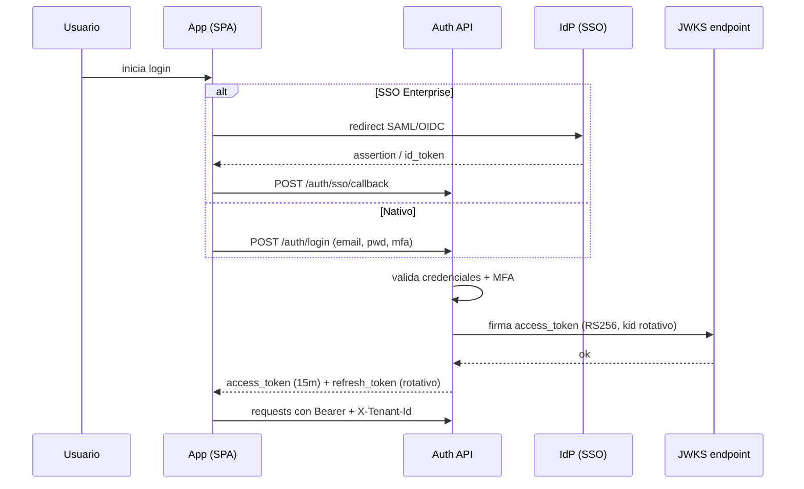

# 03 — Identidad, Seguridad y RBAC/ABAC

> Especificación original: **§2.2, §3**. Decisiones: **ADR-0013** (audit ledger), **ADR-0012** (MinIO). Relacionado: `02` (tenant context), `13` (DevSecOps), `12` (telemetría).

## 1. Modelo de identidad

La identidad se gestiona con un **Identity Provider (IdP)** interno para Starter/Growth y federación **SSO empresarial** (SAML 2.0 / OIDC) para Enterprise/VIP. Toda identidad vive **dentro** de un tenant: no hay usuarios globales con acceso cross-tenant.

### Flujos de autenticación
- **Registro de tenant / primer admin:** captura de *lead* (ver `08`) → *provisioning* → email de verificación → el primer usuario recibe rol **Tenant Admin**.
- **Login nativo:** email + contraseña (argon2id) + **MFA obligatorio** (TOTP/WebAuthn).
- **SSO (Enterprise/VIP):** redirección al IdP del cliente; el *assertion*/`id_token` se valida y se mapea al usuario local (aprovisionamiento *just-in-time*).
- **Cliente externo:** cuenta invitada con *scope* acotado, MFA obligatorio y expiración configurable.



## 2. JWT y rotación de claves (JWKS)

- **Algoritmo:** RS256 (asimétrico). La API firma con clave privada; los servicios y el *edge* verifican con la **clave pública publicada en JWKS**.
- **Rotación:** `kid` rotativo con solapamiento; la clave saliente se conserva *grace period* (p. ej. 24 h) para no invalidar tokens en vuelo.
- **Lifetime:** `access_token` 15 min, `refresh_token` rotativo con detección de reúso (rotación + *reuse detection*). Claims: `sub`, `tenant_id`, `tier`, `roles`, `scp`, `exp`, `iat`, `jti`.

```python
# apps/backend/src/identity/jwt_service.py
from dataclasses import dataclass
from typing import Iterable
import jwt  # PyJWT
from cryptography.hazmat.primitives.asymmetric.rsa import RSAPrivateKey


@dataclass(frozen=True)
class TokenClaims:
    sub: str
    tenant_id: str
    tier: str
    roles: tuple[str, ...]
    scopes: tuple[str, ...]


class JwtService:
    def __init__(self, private_key: RSAPrivateKey, kid: str, issuer: str):
        self._key = private_key
        self._kid = kid
        self._issuer = issuer

    def issue_access_token(self, claims: TokenClaims, ttl_seconds: int = 900) -> str:
        import time, uuid
        now = int(time.time())
        payload = {
            "iss": self._issuer,
            "sub": claims.sub,
            "tenant_id": claims.tenant_id,
            "tier": claims.tier,
            "roles": list(claims.roles),
            "scp": list(claims.scopes),
            "iat": now,
            "exp": now + ttl_seconds,
            "jti": str(uuid.uuid4()),
        }
        return jwt.encode(payload, self._key, algorithm="RS256",
                          headers={"kid": self._kid})
```

## 3. Matriz RBAC/ABAC — 9 roles

Se aplica **RBAC** (rol → permisos) reforzado con **ABAC** por atributos de recurso (p. ej. "el PM solo edita tareas de sus proyectos"). La matriz define permisos por **recurso**; la letra indica la acción: **C**rear, **R**ear, **U**pdate, **D**elete, **A**probar.

| Recurso \ Rol | SuperAdmin | Tenant Admin | PM | Scrum Master | Product Owner | Developer | QA | Cliente Externo | Auditor |
|---|---|---|---|---|---|---|---|---|---|
| **Tenants / config tenant** | CRUD (global) | RU (propio) | R | R | — | — | — | — | R |
| **Usuarios / invites** | — | CRU**D** | R | R | R | — | — | — | R |
| **Projects** | — | CRUDA | CRUDA | RU | CRU | R | R | R | R |
| **Tasks / issues** | — | R | CRUD | CRUD | CRU | CRU (asignadas) | CRU (testing) | R (asignadas) | R |
| **Time logs** | — | R (todos) | CRUD (equipo) | CRUD (equipo) | R | CRU (propios) | CRU (propios) | — | R |
| **Financial contracts / márgenes** | — | R | R | R | CRU | — | — | R (acordados) | R |
| **Invoices / billing** | — | R | — | — | — | — | — | R (propias) | R |
| **Audit logs** | R (global) | R (tenant) | — | — | — | — | — | — | R (tenant) |
| **Reports / dashboards** | R (global) | R | R | R | R | R (propios) | R | R (acordados) | R |
| **Webhooks / integraciones** | — | CRU**D** | R | — | R | — | — | — | R |

**Notas ABAC:**
- **Developer/QA:** solo pueden editar *tasks* y *time logs* en los que son asignados (atributo `assignee_id = sub`).
- **Cliente externo:** lectura restringida a *tasks* marcadas como `client_visible = true` y a sus propias facturas.
- **Auditor:** **solo lectura global dentro del tenant**, sin capacidad de mutar; sus accesos quedan registrados en el audit ledger.
- **SuperAdmin:** existe solo a nivel de plataforma (no pertenece a ningún tenant de negocio); opera *break-glass* con MFA hardware y registro reforzado.

## 4. Aplicación de permisos (policy enforcer)

Los permisos se evalúan en un **policy engine** central, invocado por *dependencies* de FastAPI, combinando el rol del JWT con atributos del recurso cargado.

```python
# apps/backend/src/identity/policy.py
from dataclasses import dataclass
from enum import Flag, auto

class Action(Flag):
    NONE = 0
    CREATE = auto()
    READ = auto()
    UPDATE = auto()
    DELETE = auto()
    APPROVE = auto()

# MATRIZ: recurso -> {rol -> acciones permitidas}
RBAC_MATRIX: dict[str, dict[str, Action]] = {
    "task": {
        "PM": Action.CREATE | Action.READ | Action.UPDATE | Action.DELETE,
        "Developer": Action.CREATE | Action.READ | Action.UPDATE,
        "QA": Action.CREATE | Action.READ | Action.UPDATE,
        "Client": Action.READ,
        "Auditor": Action.READ,
    },
    # ... resto de recursos de la matriz de la sección 3
}

@dataclass
class Subject:
    user_id: str
    tenant_id: str
    role: str

def authorize(subject: Subject, resource: str, action: Action,
              resource_attrs: dict | None = None) -> bool:
    allowed = RBAC_MATRIX.get(resource, {}).get(subject.role, Action.NONE)
    if action not in (allowed & action):  # acción no concedida por rol
        return False
    # Reglas ABAC adicionales por atributo de recurso
    if subject.role == "Developer" and resource == "task":
        return resource_attrs and resource_attrs.get("assignee_id") == subject.user_id
    if subject.role == "Client" and resource == "task":
        return bool(resource_attrs and resource_attrs.get("client_visible"))
    return True
```

## 5. Audit ledger inmutable (ADR-0013)

El **audit ledger** registra eventos de seguridad y cambios críticos (login, MFA, cambios de permisos, accesos a datos sensibles, *break-glass*). Es **append-only**, **tamper-evident** (encadenamiento por hash) y se exporta a **MinIO en modo WORM** para retención extendida (SOC2/GDPR).

### Esquema del ledger
```sql
CREATE TABLE audit_log (
    seq          BIGSERIAL PRIMARY KEY,                 -- monótono
    event_id     UUID NOT NULL UNIQUE,                  -- idempotencia
    tenant_id    UUID NOT NULL,
    actor_id     UUID,                                  -- usuario o 'system'
    action       TEXT NOT NULL,                         -- identity.login, rbac.grant...
    resource     TEXT NOT NULL,
    resource_id  TEXT,
    outcome      TEXT NOT NULL,                         -- success | denied | error
    metadata     JSONB NOT NULL DEFAULT '{}',
    occurred_at  TIMESTAMPTZ NOT NULL DEFAULT now(),
    prev_hash    BYTEA NOT NULL,                        -- hash(seq-1)
    event_hash   BYTEA NOT NULL                         -- sha256(prev_hash || canonical_json(event))
);

-- Append-only: solo INSERT
REVOKE UPDATE, DELETE ON audit_log FROM app_role;
CREATE INDEX idx_audit_tenant_time ON audit_log (tenant_id, occurred_at DESC);
```

### Encadenamiento por hash (tamper-evident)
```python
# apps/backend/src/audit/ledger.py
import hashlib, json, uuid
from datetime import datetime, timezone

async def append_audit_event(tx, *, tenant_id, actor_id, action, resource,
                             resource_id, outcome, metadata):
    prev = await tx.fetchrow(
        "SELECT event_hash FROM audit_log ORDER BY seq DESC LIMIT 1")
    prev_hash = prev["event_hash"] if prev else bytes(32)
    body = json.dumps({
        "event_id": str(uuid.uuid4()), "tenant_id": str(tenant_id),
        "actor_id": str(actor_id), "action": action, "resource": resource,
        "resource_id": resource_id, "outcome": outcome, "metadata": metadata,
        "occurred_at": datetime.now(timezone.utc).isoformat(),
    }, sort_keys=True)
    event_hash = hashlib.sha256(prev_hash + body.encode()).digest()
    await tx.execute(
        """INSERT INTO audit_log
             (event_id, tenant_id, actor_id, action, resource, resource_id,
              outcome, metadata, prev_hash, event_hash)
           VALUES ($1,$2,$3,$4,$5,$6,$7,$8,$9,$10)""",
        uuid.UUID(body_uuid(body)), tenant_id, actor_id, action, resource,
        resource_id, outcome, json.dumps(metadata), prev_hash, event_hash,
    )
```

> La verificación de integridad recorre la cadena recomputando `event_hash` desde `seq=1`; cualquier alteración rompe la cadena y dispara una alerta de seguridad (ver `12`).

### Retención y export WORM
- **Hot:** retención consultable en PG (p. ej. 90 días).
- **Cold (WORM):** *job* diario exporta particiones cerradas a MinIO con *object-lock* (retención inmutable de 7 años para VIP); política de *lifecycle* por tier.

```yaml
# Ejemplo de política de export WORM a MinIO (referencia)
bucket: audit-ledger-archive
mode: COMPLIANCE          # no borrable ni por admin hasta retención
retention_days: 2555      # ~7 años (VIP); 1095 (~3 años) para Enterprise
encryption: aws:kms       # SSE-KMS equivalente (MinIO KMS)
versioning: enabled
```

## 6. Cifrado y gestión de secretos

- **En tránsito:** TLS 1.3 universal (edge + service mesh interno en K8s); HSTS, *certificate transparency*.
- **En reposo:** AES-256 (transparente en PG vía *tablespaces* cifrados / volumen cifrado; MinIO SSE; backups cifrados).
- **Secretos:** **HashiCorp Vault** (primario) o **AWS Secrets Manager** (alternativa cloud). Ningún secreto en imagen ni en repo. Rotación de credenciales de BBDD por *dynamic secrets*.
- **Claves de firma JWT:** almacenadas en Vault *Transit* con rotación programada; el `kid` publica el JWKS público.

```hcl
# Ejemplo Vault Transit para firma JWT (referencia)
path "transit/keys/jwt-signer" {
  capabilities = ["read"]
}
path "transit/sign/jwt-signer" {
  capabilities = ["update"]
}
# Rotación: vault write transit/keys/jwt-signer/rotate -> nuevo kid
```

## 7. MFA obligatorio y anti-abuso

- **MFA obligatorio** para todo usuario; WebAuthn preferido (resistente a *phishing*) con *fallback* TOTP.
- *Break-glass* (SuperAdmin) requiere **MFA hardware** (FIDO2) y genera entrada de audit ledger reforzada + notificación en tiempo real.
- **Rate-limit** de login por IP y por cuenta (ver `13`); detección de *credential stuffing*.

La trazabilidad de toda esta superficie (logs con `tenant_id`, `actor_id`, `trace_id`) se describe en `12`, y las garantías del *pipeline* de seguridad en `13`.
