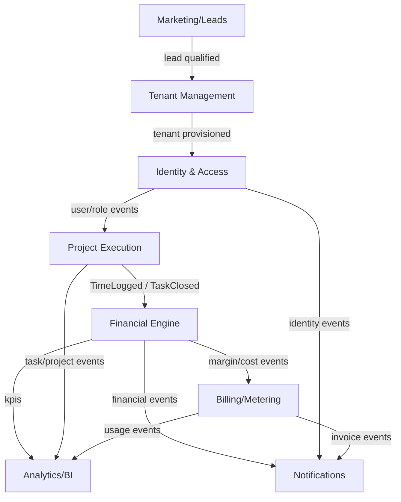
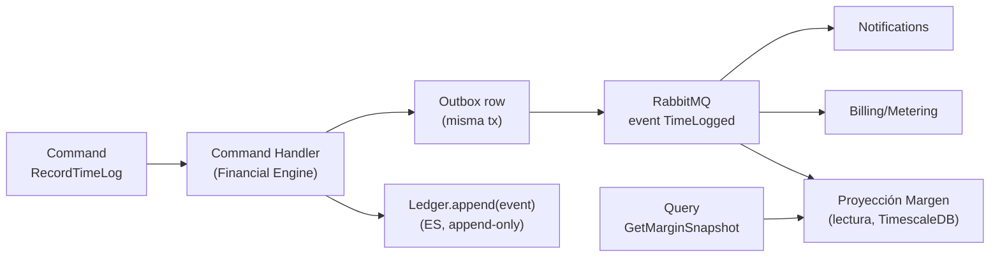

# 04 — Diseño de Dominio: DDD, CQRS y Event Sourcing

> Especificación original: **§5.1**. Decisiones: **ADR-0006** (CQRS selectivo + ES en ledgers). Relacionado: `05` (eventos), `06` (Financial Engine), `14` (Billing/Metering).

## 1. Filosofía: pragmatismo sobre dogma

El dominio se modela con **DDD táctico y estratégico donde el negocio lo justifica** y con **CRUD simple donde basta**. La regla rectora (ADR-0006) es: el **Event Sourcing vive únicamente en los ledgers** (financiero, auditoría, metering), donde la inmutabilidad, la trazabilidad y la rederivación del estado son requisitos de cumplimiento. El *core* de PM (*Project Execution*) es CRUD + eventos de dominio, para mantener agilidad y simplicidad operativa.

## 2. *Bounded Contexts*



| Contexto | Responsabilidad | Estilo | ES |
|---|---|---|---|
| **Tenant Management** | Ciclo de vida del tenant, tier, *routing target*, *provisioning*, upgrades de tier | Hexagonal | No |
| **Identity & Access** | Usuarios, roles, permisos, MFA, SSO, sesiones | Hexagonal | No (audit ledger sí: ver `03`) |
| **Project Execution** | Proyectos, *tasks*, *sprints*, *boards*, asignaciones, estado | Hexagonal ligero + CRUD | No |
| **Financial Engine** | Time logs → costos, márgenes, contratos financieros, SLA | Hexagonal + CQRS | **Sí (ledger financiero)** |
| **Billing/Metering** | Captura y agregación de uso, eventos de uso, facturación | Hexagonal + CQRS | **Sí (ledger de metering)** |
| **Marketing/Leads** | Captura de *leads*, scoring, nutrición, ROI de la landing | CRUD + eventos | No |
| **Analytics/BI** | Proyecciones de lectura, dashboards, métricas de negocio | CQRS (lado lectura) | No |
| **Notifications** | Email/push/in-app, plantillas, preferencias, reintentos | Hexagonal ligero | No |

## 3. Arquitectura hexagonal (por módulo)

Cada *bounded context* de lógica de negocio sigue **Ports & Adapters**, con dependencias apuntando siempre al dominio:

```
libs/financial-engine/
  src/
    domain/            # entidades, value objects, eventos de dominio (puro, sin I/O)
      events.py        # TimeLogged, MarginUpdated, SLABreachRiskChanged
      ledger.py        # FinancialLedger (aggregate root, append-only)
      contract.py      # FinancialContract
    application/       # casos de uso / command & query handlers (CQRS)
      commands/        # RecordTimeLog, RecomputeMargin, CloseTask
      queries/         # GetMarginSnapshot, GetSLAForecast
      ports/           # interfaces: LedgerRepository, Clock, EventBus
    infrastructure/    # adaptadores: SQLAlchemy, RabbitMQ publisher, TimescaleDB
      persistence/
      messaging/
    api/               # controladores FastAPI (HTTP) + DTOs Pydantic
```

### Ejemplo de agregado con Event Sourcing (Financial Ledger)
```python
# libs/financial-engine/src/domain/ledger.py
from dataclasses import dataclass, field
from datetime import datetime, UTC
from decimal import Decimal
from uuid import UUID, uuid4


@dataclass(frozen=True)
class LedgerEvent:
    event_id: UUID
    contract_id: UUID
    amount: Decimal            # positivo = costo devengado
    occurred_at: datetime
    kind: str                  # TIME_LOGGED | MARGIN_ADJUSTMENT | SLA_RECALC


@dataclass
class FinancialLedger:
    contract_id: UUID
    events: list[LedgerEvent] = field(default_factory=list)

    def append(self, event: LedgerEvent) -> None:
        # append-only: el estado NUNCA se muta, solo se agregan eventos
        self.events.append(event)

    # El estado (costo acumulado, margen) se DERIVA rejugando los eventos
    @property
    def total_cost(self) -> Decimal:
        return sum((e.amount for e in self.events), Decimal("0"))

    def margin(self, contract_value: Decimal) -> Decimal:
        if contract_value == 0:
            return Decimal("0")
        return (contract_value - self.total_cost) / contract_value
```

> El lado **escritura** solo hace *append*; el lado **lectura** (dashboards de margen) se alimenta de una **proyección** materializada que se actualiza al consumir los eventos. Esta separación es la esencia del CQRS aplicado aquí (ADR-0006).

## 4. ADR-0006: CQRS selectivo + Event Sourcing en ledgers

### Contexto / Problema
Las cargas son **fuertemente asimétricas**: pocas escrituras (un timer que actualiza horas) generan mucha lectura agregada (dashboards de margen por proyecto/tenant con miles de lecturas concurrentes). Un modelo CRUD único contiende la BBDD en picos de dashboard. Paralelamente, finanzas y metering exigen **trazabilidad e inmutabilidad** (auditoría, no duplicar cargos, reproducir saldo).

### Opciones
1. **CRUD uniforme para todo** (sin CQRS, sin ES).
2. **CQRS + Event Sourcing completos** en todo el sistema.
3. **CQRS selectivo + ES solo en ledgers** (financiero, auditoría, metering); PM *core* = CRUD + eventos de dominio.

### Criterios
- Contención en lecturas de dashboards (escala de 5 k usuarios).
- Costo de complejidad y mantenimiento para un equipo mediano.
- Necesidad de inmutabilidad/auditoría por dominio.
- Capacidad de rederivar estado (replay) en financieros.

### Decisión
**Opción 3.** CQRS donde hay asimetría real de cargas (Financial Engine, Billing/Metering, Analytics) con proyecciones de lectura; Event Sourcing **únicamente** en ledgers. Project Execution permanece CRUD + eventos publicados vía *Outbox* (`05`).

### Consecuencias
- **(+)** Las lecturas de dashboards escalan en proyecciones optimizadas (TimescaleDB/materializadas) sin contender con escrituras.
- **(+)** Trazabilidad e inmutabilidad exactamente donde se necesita (cumplimiento).
- **(−)** Doble modelo (comandos/proyecciones) requiere disciplina; las proyecciones pueden desfasarse y necesitan *replay*.
- **(−)** Dos estilos coexistentes aumentan la curva de aprendizaje del equipo (mitigado con plantillas de *scaffold* en el monorepo, `15`).

## 5. Relación comandos / eventos / proyecciones



## 6. Lenguaje ubicuo (extracto)

| Término (ubícuo) | Significado en el contexto |
|---|---|
| *Time log* | Registro atómico de horas trabajadas con evidencia (timer/manual/Git) |
| *Devengado* | Costo reconocido en el ledger financiero al registrarse un *time log* |
| *Margen* | `(valor_contrato − costo_devengado) / valor_contrato` |
| *Burn rate* | Velocidad de consumo de presupuesto/capacidad (ver `07`) |
| *Meter* | Unidad de consumo facturable (ver `14`) |
| *SLA risk* | Probabilidad de incumplir un compromiso del contrato (ver `07`) |

## 7. Anti-patrones explícitamente evitados
- **Anemic domain model en ledgers:** la lógica de derivación vive en el agregado, no dispersa en servicios.
- **ES "por moda":** no se aplica ES en *tasks/sprints* (no aporta valor y multiplica complejidad).
- **Acoplamiento por BBDD compartida entre contextos:** los contextos se comunican por **eventos y APIs**, nunca leyendo tablas ajenas.

La mecánica de publicación/confianza de esos eventos se detalla en `05`.
