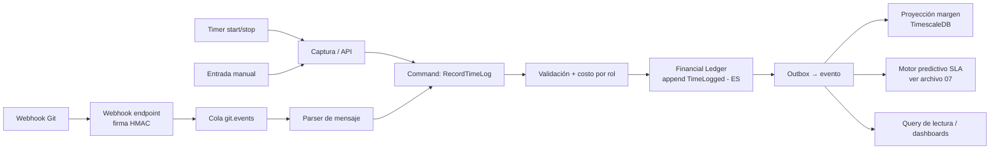
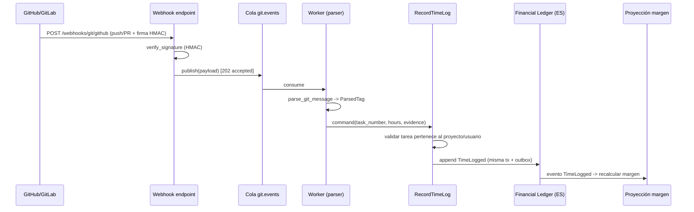

# 06 — Motor FinOps y Registro de Tiempo (Time Tracking)

> Especificación original: **§2.3**. Decisiones: **ADR-0007** (TimescaleDB), **ADR-0006** (ES en ledger financiero). Relacionado: `04` (Financial Engine), `05` (eventos), `07` (predictivo/SLA).

## 1. Objetivo del motor

Convertir **toda hora trabajada en un evento financiero verificable** que impacta, en tiempo real, el **costo devengado**, el **margen del contrato** y la **probabilidad de cumplimiento de SLA**. Tres fuentes de captura, todas zero-friction:

| Fuente | Origen | Evidencia |
|---|---|---|
| **Timer en tiempo real** | UI de la app (start/stop) | Sesión + *timestamps* verificados por servidor |
| **Entrada manual** | UI / API | Justificación + auditoría |
| **Webhook de Git** | GitHub/GitLab (commit/PR) | Referencia al commit/PR + *tag* en mensaje |

## 2. Pipeline de extremo a extremo



## 3. Webhook de Git (captura sin UI)

El desarrollador referencia el trabajo **dentro del mensaje del commit o PR** con *tags* estructurados. El sistema los parsea, valida la pertenencia al proyecto/tarea y genera registros de tiempo sin abrir la UI.

**Formato de *tags* soportados** (regex tolerante, insensible a mayúsculas):
- `Resolves #102 [Time: 2h]` — cierra la tarea 102 y registra 2 horas.
- `Refs #102 [Time: 90m]` — registra 90 minutos sin cerrar.
- `[Time: 1.5h]` — registro flotante (requiere *task* por defecto en la rama).

### Endpoint del webhook (referencia)
```python
# apps/backend/src/webhooks/git_router.py
import hmac, hashlib
from fastapi import APIRouter, Header, HTTPException, Request
from .parser import parse_git_message

router = APIRouter(prefix="/webhooks/git", tags=["webhooks"])


def verify_signature(secret: bytes, body: bytes, signature: str, provider: str) -> bool:
    if provider == "github":
        digest = "sha256=" + hmac.new(secret, body, hashlib.sha256).hexdigest()
    elif provider == "gitlab":
        digest = hmac.new(secret, body, hashlib.sha256).hexdigest()
    else:
        return False
    return hmac.compare_digest(digest, signature)


@router.post("/{provider}")
async def git_webhook(
    provider: str,
    request: Request,
    x_hub_signature_256: str | None = Header(None),
    x_gitlab_token: str | None = Header(None),
):
    body = await request.body()
    secret = request.app.state.git_webhook_secret
    sig = x_hub_signature_256 or x_gitlab_token
    if not sig or not verify_signature(secret.encode(), body, sig, provider):
        raise HTTPException(401, "webhook.invalid_signature")

    payload = await request.json()
    # Encolar para procesamiento asíncrono (sin tocar el ledger sincrónicamente)
    await request.app.state.git_queue.publish(
        {"provider": provider, "payload": payload}
    )
    return {"status": "accepted"}
```

### Parser de mensaje
```python
# apps/backend/src/webhooks/parser.py
import re
from dataclasses import dataclass
from decimal import Decimal

_TIME_TAG = re.compile(r"\[Time:\s*(?P<value>\d+(?:\.\d+)?)\s*(?P<unit>h|m)\]",
                       re.IGNORECASE)
_REF_TAG = re.compile(r"(?P<verb>resolves|refs|fixes|closes)\s+#(?P<task>\d+)",
                      re.IGNORECASE)
_UNIT_TO_HOURS = {"h": Decimal("1"), "m": Decimal("1") / Decimal("60")}


@dataclass(frozen=True)
class ParsedTag:
    task_number: int | None
    hours: Decimal
    closes_task: bool


def parse_git_message(message: str) -> ParsedTag | None:
    t = _TIME_TAG.search(message)
    if not t:
        return None
    hours = Decimal(t.group("value")) * _UNIT_TO_HOURS[t.group("unit").lower()]
    ref = _REF_TAG.search(message)
    if ref:
        verb = ref.group("verb").lower()
        return ParsedTag(
            task_number=int(ref.group("task")),
            hours=hours,
            closes_task=verb in {"resolves", "fixes", "closes"},
        )
    return ParsedTag(task_number=None, hours=hours, closes_task=False)
```

### Diagrama de secuencia: webhook Git → ledger


## 4. Cálculo de costo (horas × costo por rol)

El costo se resuelve a partir del **costo por hora del rol/usuario** en el contexto del contrato. Cada *time log* genera un evento `TimeLogged` con `amount = hours × role_cost_per_hour` que se **devenga** en el ledger.

```python
# libs/financial-engine/src/application/commands/record_time_log.py
from decimal import Decimal
from uuid import UUID
from ...domain.ledger import FinancialLedger, LedgerEvent
from datetime import datetime, UTC


async def record_time_log(*, tx, ledger_repo, project_repo, clock,
                          tenant_id: UUID, user_id: UUID, project_id: UUID,
                          task_id: UUID, hours: Decimal, evidence: str):
    role_cost = await project_repo.role_cost_for(tenant_id, project_id, user_id)
    amount = (hours * role_cost).quantize(Decimal("0.01"))

    ledger = await ledger_repo.get_or_create(project_id)
    event = LedgerEvent(
        event_id=...,
        contract_id=project_id,
        amount=amount,
        occurred_at=clock.now(UTC),
        kind="TIME_LOGGED",
    )
    ledger.append(event)                      # ES: append-only
    await ledger_repo.save(tx, ledger)        # persiste evento + outbox (misma tx)
    return event
```

## 5. Modelo de datos: TimescaleDB (ADR-0007)

Los *time logs* y los agregados de metering son **series temporales** de alta cardinalidad (muchos usuarios × muchas tareas × timestamps). Se almacenan en **hypertables** de TimescaleDB para inserciones rápidas y agregaciones por ventanas eficientes.

```sql
-- Time logs: tabla origen
CREATE TABLE time_logs (
    id            BIGSERIAL,
    tenant_id     UUID NOT NULL,
    user_id       UUID NOT NULL,
    project_id    UUID NOT NULL,
    task_id       UUID NOT NULL,
    hours         NUMERIC(5,2) NOT NULL CHECK (hours > 0),
    role_cost     NUMERIC(10,2) NOT NULL,
    amount        NUMERIC(12,2) NOT NULL,         -- hours * role_cost
    evidence      TEXT NOT NULL,                   -- manual|timer|git:commit|git:pr
    source_ref    TEXT,                            -- sha / pr url
    logged_at     TIMESTAMPTZ NOT NULL DEFAULT now(),
    PRIMARY KEY (id, logged_at)
);
SELECT create_hypertable('time_logs', 'logged_at');
CREATE INDEX idx_timelogs_tenant_project ON time_logs (tenant_id, project_id, logged_at DESC);

-- Proyección de lectura: costo devengado por contrato y día (continuous aggregate)
CREATE MATERIALIZED VIEW margin_daily
WITH (timescaledb.continuous) AS
SELECT
    time_bucket('1 day', logged_at) AS day,
    tenant_id,
    project_id,
    sum(amount)                       AS cost_devengado,
    count(*)                          AS entries
FROM time_logs
GROUP BY day, tenant_id, project_id;
```

## 6. Proyecciones de lectura (CQRS)

El **margen en tiempo real** es una proyección que se actualiza al consumir `TimeLogged`. Los dashboards consultan proyecciones, no el ledger, evitando contención.

```sql
-- Snapshot de margen por contrato (proyección actualizable)
CREATE TABLE margin_snapshot (
    tenant_id        UUID NOT NULL,
    project_id       UUID NOT NULL,
    contract_value   NUMERIC(14,2) NOT NULL,
    cost_devengado   NUMERIC(14,2) NOT NULL DEFAULT 0,
    margin_pct       NUMERIC(5,2)  GENERATED ALWAYS AS
        (CASE WHEN contract_value = 0 THEN 0
              ELSE ((contract_value - cost_devengado) / contract_value) * 100 END) STORED,
    updated_at       TIMESTAMPTZ NOT NULL DEFAULT now(),
    PRIMARY KEY (tenant_id, project_id)
);
```

```python
# apps/workers/src/subscribers/margin_projection.py
async def handle_time_logged(msg, is_vip):
    async with db.begin():
        await run_idempotent(db_tx, msg.event_id, "fin.margin_projection", lambda tx: (
            tx.execute("""INSERT INTO margin_snapshot
                            (tenant_id, project_id, contract_value, cost_devengado, updated_at)
                          VALUES ($1,$2,$3,$4,now())
                          ON CONFLICT (tenant_id, project_id) DO UPDATE
                            SET cost_devengado = margin_snapshot.cost_devengado + EXCLUDED.cost_devengado,
                                updated_at = now()""",
                       msg.tenant_id, msg.project_id,
                       await get_contract_value(msg.project_id), msg.hours * msg.role_cost_per_hour)
        ))
```

## 7. Impacto en SLA en tiempo real

El devengo alimenta también el **motor predictivo** (`07`): cada `TimeLogged` recalcula el *burn rate* de presupuesto/capacidad y la probabilidad de quiebre de SLA. La unión de los dos motores (FinOps + predictivo) es lo que distingue a la plataforma (ver `01`).

## 8. Consideraciones operativas
- **Backpressure:** picos de webhooks (p. ej. *merge trains*) se absorben con la cola `git.events` y *consumers* escalables (HPA por profundidad de cola, `10`).
- **VIP priority:** los tenants VIP tienen cola prioritaria para que su margen/SLA se actualice primero (ADR-0014).
- **Anti-fraude de horas:** detección de anomalías (horas > capacidad diaria, solapamientos) dispara *workflow* de aprobación en lugar de registro directo.
