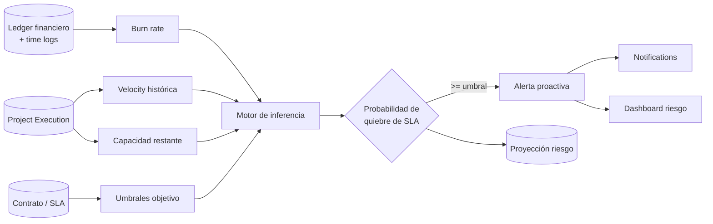

# 07 — Analítica Predictiva y Riesgo de SLA

> Especificación original: **§2.4**. Relacionado: `06` (FinOps/ledger), `05` (colas prioritarias), `12` (telemetría), `14` (VIP).

## 1. Propósito

Anticipar el **quiebre de SLA y el sobrecosto** antes de que ocurran. El motor cruza tres señales:

1. **Velocity histórica** — tasa real de avance del proyecto (story points/horas completadas por unidad de tiempo).
2. **Capacidad** — horas-persona disponibles en la ventana restante (considerando asignaciones, festivos y carga VIP).
3. **Burn rate presupuestario** — velocidad de consumo de presupuesto/costo devengado respecto al valor del contrato (señal proveniente del Financial Engine, `06`).

Con estas tres señales se estima la **probabilidad de incumplir** el SLA o exceder el margen objetivo, y se emiten **alertas proactivas** accionables ("riesgo de quiebre de SLA 85 %").

## 2. Modelo conceptual



## 3. Estrategia de cómputo

La analítica combina **jobs batch periódicos** (recálculo completo por proyecto/tenant) con **inferencia reactiva** (recálculo inmediato al llegar un `TimeLogged` o cambio de capacidad). Para mantener costo acotado:

- **Batch (cada N minutos / nocturno):** recalcula proyectos activos con ventana histórica deslizante (p. ej. 6 semanas). Ideal para detección de tendencia.
- **Reactiva (por evento):** recalcula solo proyectos en zona de riesgo (`margin_pct < umbral` o SLA crítico), acotando el costo. Los eventos viajan por **colas dedicadas con prioridad VIP** (ADR-0014) para que los tenants VIP se evalúen primero.

### Job batch (referencia)
```python
# apps/workers/src/analytics/sla_batch.py
from datetime import timedelta

async def run_sla_batch(db, now, window_weeks: int = 6):
    horizon = now - timedelta(weeks=window_weeks)
    projects = await db.fetch(
        """SELECT project_id, tenant_id, tier
             FROM active_projects
            WHERE updated_at >= $1""", horizon)
    for p in projects:
        # Encolar a la cola con prioridad según tier
        priority = 10 if p["tier"] == "vip" else 0
        await db.execute(
            "SELECT enqueue_sla_eval($1, $2, $3)", p["project_id"], p["tenant_id"], priority)
```

### Inferencia por proyecto (referencia)
```python
# apps/workers/src/analytics/sla_evaluator.py
from decimal import Decimal

THRESHOLDS = {"warn": 0.50, "high": 0.75, "critical": 0.85}


async def evaluate_sla_risk(signals_repo, project_id) -> dict:
    s = await signals_repo.load(project_id)
    # Capacidad necesaria para cumplir a tiempo vs capacidad restante
    capacity_gap = s.remaining_work_hours - s.capacity_hours
    # Probabilidad simple de cumplimiento: cuán cubierta está la capacidad,
    # penalizada por la deriva histórica de la velocity.
    drift = s.historical_velocity / s.planned_velocity if s.planned_velocity else 1
    coverage = (s.capacity_hours * drift) / s.remaining_work_hours \
        if s.remaining_work_hours > 0 else 1
    p_meet = max(0.0, min(1.0, coverage))
    p_breach = 1 - p_meet

    level = "ok"
    for name, thr in THRESHOLDS.items():
        if p_breach >= thr:
            level = name
    return {"project_id": str(project_id), "p_breach": round(p_breach, 3),
            "level": level, "burn_rate": float(s.burn_rate), "drift": float(drift)}
```

> El modelo anterior es deliberadamente **interpretable y rederivable** desde los ledgers, alineado con el principio P1 (datos como fuente de verdad). Versiones posteriores pueden sustituirlo por modelos ML más ricos sin cambiar el contrato de eventos.

## 4. Alertas proactivas

Las alertas se emiten por **cambio de nivel** (no por cada evaluación), para evitar fatiga. Tienen *severity*, `project_id`, `tenant_id`, `p_breach`, `burn_rate` y una **acción sugerida** (p. ej. "renegociar alcance", "sumar capacidad").

```python
# apps/workers/src/analytics/alerting.py
SEVERITY = {"ok": "info", "warn": "warning", "high": "high", "critical": "critical"}


async def maybe_alert(notifier, prev_level, result, tenant_id, project_id):
    level = result["level"]
    if level == prev_level or level == "ok":
        return
    await notifier.notify(
        topic="sla.risk_changed",
        tenant_id=tenant_id,
        severity=SEVERITY[level],
        payload={
            "project_id": project_id,
            "p_breach": result["p_breach"],
            "burn_rate": result["burn_rate"],
            "message": f"Riesgo de quiebre de SLA {int(result['p_breach']*100)}%",
        },
    )
```

## 5. Proyección de riesgo (lectura)
```sql
CREATE TABLE sla_risk_snapshot (
    tenant_id    UUID NOT NULL,
    project_id   UUID NOT NULL,
    p_breach     NUMERIC(4,3) NOT NULL,    -- 0.000..1.000
    level        TEXT NOT NULL,            -- ok|warn|high|critical
    burn_rate    NUMERIC(8,4) NOT NULL,
    drift        NUMERIC(6,3) NOT NULL,
    evaluated_at TIMESTAMPTZ NOT NULL DEFAULT now(),
    PRIMARY KEY (tenant_id, project_id)
);
CREATE INDEX idx_sla_risk_level ON sla_risk_snapshot (level, evaluated_at DESC);
```

## 6. Priorización VIP

Los tenants VIP reciben **evaluación prioritaria y más frecuente** (cola `analytics.sla.vip`, `x-max-priority=10`) y umbrales más estrictos configurables por contrato. Esto materializa el "tratamiento VIP" end-to-end: del timer (`06`) a la predicción (`07`), pasando por la mensajería (`05`).

## 7. Observabilidad del motor
Métricas clave (ver `12`): `sla.eval.duration`, `sla.alerts.emitted{level}`, `sla.projects_at_risk{level}`, `analytics.batch.lag`. La precisión del modelo (falsos positivos/negativos sobre quiebres reales) es una métrica de negocio auditada mensualmente y referenciada en los riesgos del proyecto (`16`).
