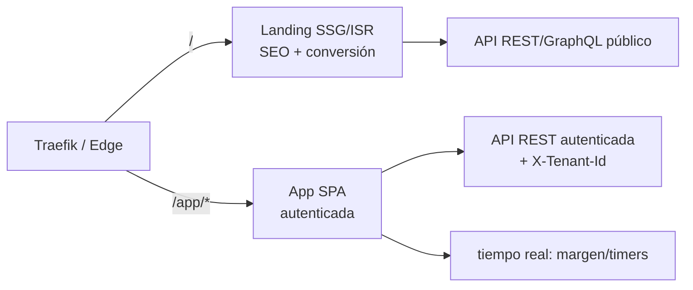
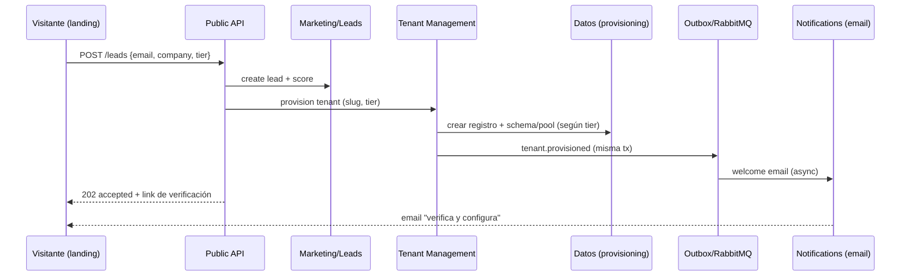

# 08 — Frontend, Design System y Landing

> Especificación original: **§3 (incluye §3.2 de secciones de landing)**. Decisiones: **ADR-0008** (Next.js App Router). Relacionado: `01` (diferenciación/ROI), `15` (monorepo).

## 1. Arquitectura dual: Landing (SSG) + App (SPA)

El frontend es **un solo monorepo Next.js** con dos *surfaces* diferenciadas por propósito y tráfico:

| Surface | Propósito | Render | Objetivo | Ruta |
|---|---|---|---|---|
| **Landing** | Marketing, SEO, captura de *leads*, ROI calculator, pricing | **SSG/ISR** (estática + revalidación) | Conversión, performance, indexación | `/` |
| **App** | Producto (PM + FinOps + dashboards) | **SPA** (CSR) en cliente autenticado | UX rica, tiempo real, interactividad | `/app/*` |

- La **landing** se pre-renderiza para máxima velocidad y SEO; los datos dinámicos (métricas, testimonios) usan **ISR** con revalidación.
- La **app** carga como SPA tras autenticación; usa **TanStack Query** (datos servidor) y **Zustand** (estado UI), con SSE/WebSocket para tiempo real (timers, margen).



## 2. Design System

Stack de diseño: **Tailwind CSS** + **shadcn/ui** + **Framer Motion**, con componentes compartidos en `libs/design-system`.

### Design Tokens
Los *tokens* son la **única fuente de verdad** para color, tipografía y espaciado, definidos como JSON y compilados a variables CSS (soportan *white-labeling* y *dark mode*).

```json
// libs/ui-tokens/src/tokens.json
{
  "color": {
    "brand": { "500": "#4f46e5", "600": "#4338ca", "contrast": "#ffffff" },
    "neutral": { "0": "#ffffff", "900": "#0b0f19" },
    "semantic": { "success": "#16a34a", "warning": "#d97706", "danger": "#dc2626" }
  },
  "typography": {
    "fontFamily": { "sans": "Inter, system-ui, sans-serif", "mono": "JetBrains Mono, monospace" },
    "scale": { "sm": "0.875rem", "base": "1rem", "lg": "1.125rem", "xl": "1.5rem", "2xl": "2.25rem" }
  },
  "spacing": { "unit": "0.25rem", "radius": "0.5rem" }
}
```

Compilados a CSS variables y consumidos por Tailwind:
```css
/* libs/ui-tokens/dist/tokens.css */
:root {
  --color-brand-500: #4f46e5;
  --color-brand-600: #4338ca;
  --color-neutral-0: #ffffff;
  --color-neutral-900: #0b0f19;
}
[data-theme="dark"] {
  --color-neutral-0: #0b0f19;
  --color-neutral-900: #f8fafc;
}
```

### White-labeling por tenant
Cada tenant sobrescribe los *tokens* de marca desde su configuración (`tenant_branding`); la app inyecta el tema al resolver el contexto de tenant (`02`), recoloreando logo, color primario y tipografía sin *rebuild*.

```ts
// apps/app/src/theme/applyTenantTheme.ts
type TenantBranding = { brand500: string; brand600: string; logoUrl: string };

export function applyTenantTheme(b: TenantBranding) {
  const root = document.documentElement;
  root.style.setProperty('--color-brand-500', b.brand500);
  root.style.setProperty('--color-brand-600', b.brand600);
  // dark mode persiste como atributo independiente (data-theme)
}
```

### Light/Dark Mode
El modo se controla con `data-theme` y respeta `prefers-color-scheme`; los tokens neutros se invierten. La preferencia del usuario se persiste.

## 3. Landing: secciones de conversión (§3.2)

La landing está estructurada para guiar al visitante al *signup* con evidencia de valor:

1. **Hero** — propuesta PM+FinOps + CTA primario ("Calcula tu ROI") y secundario ("Ver demo").
2. **Social Proof & métricas** — logos de clientes + métricas verificables (ej. "−40 % incumplimiento de SLA").
3. **Diferenciación** — comparativa visual vs. Jira/Asana/ClickUp (ver `01`).
4. **Interactive ROI Calculator** — componente interactivo (ver §4).
5. **Pricing Grid** — tiers Starter/Growth, Enterprise, VIP/Custom (ver `14`).
6. **Cómo funciona** — *zero-friction*: captura vía Git sin UI.
7. **FAQ / Seguridad** — SOC2/GDPR, RBAC, audit ledger.
8. **Footer + CTA final.**

## 4. Componentes clave de conversión

### Interactive ROI Calculator
Componente React con lógica de cálculo en cliente (autocontenido, sin llamadas servidor):

```tsx
// apps/landing/src/components/RoiCalculator.tsx
'use client';
import { useMemo, useState } from 'react';

const DEFAULTS = {
  monthlyContractValue: 100_000,
  currentOverrunPct: 0.12,     // 12% de overrun hoy
  detectionImprovementPct: 0.6, // −60% de overrun con detección temprana
};

export function RoiCalculator() {
  const [value, setValue] = useState(DEFAULTS.monthlyContractValue);
  const [overrun, setOverrun] = useState(DEFAULTS.currentOverrunPct);

  const savings = useMemo(() => {
    const currentLoss = value * overrun;
    const reducedLoss = currentLoss * (1 - DEFAULTS.detectionImprovementPct);
    return Math.round(currentLoss - reducedLoss);
  }, [value, overrun]);

  return (
    <div className="rounded-lg border p-6">
      <label>Valor mensual de contratos (USD)
        <input type="range" min={10000} max={1000000} step={10000}
               value={value} onChange={(e) => setValue(+e.target.value)} />
        <span>${value.toLocaleString()}</span>
      </label>
      <label>Overrun estimado hoy
        <input type="range" min={0.02} max={0.30} step={0.01}
               value={overrun} onChange={(e) => setOverrun(+e.target.value)} />
        <span>{Math.round(overrun * 100)}%</span>
      </label>
      <p className="mt-4 text-2xl font-semibold text-brand-500">
        Ahorro mensual estimado: ${savings.toLocaleString()}
      </p>
    </div>
  );
}
```

### Pricing Grid
Renderizado desde el catálogo de tiers (fuente única, ver `14`); resalta el tier recomendado y el CTA por tier.

```tsx
// apps/landing/src/components/PricingGrid.tsx
import { TIERS } from '@saas/api-contracts/billing';  // generado desde OpenAPI

export function PricingGrid() {
  return (
    <div className="grid gap-6 md:grid-cols-3">
      {TIERS.map((t) => (
        <article key={t.id} className={`rounded-lg border p-6 ${t.highlight ? 'border-brand-500' : ''}`}>
          <h3>{t.name}</h3>
          <p className="text-2xl font-bold">{t.priceLabel}</p>
          <ul>{t.features.map((f) => <li key={f}>{f}</li>)}</ul>
          <a href={`/signup?tier=${t.id}`} className="btn-primary">{t.cta}</a>
        </article>
      ))}
    </div>
  );
}
```

## 5. Flujo de onboarding (provisioning en caliente)

La captura del *lead* en la landing dispara el **provisioning en caliente** del tenant sin intervención manual: se crean los recursos (registro de tenant, schema/pool según tier, primer Tenant Admin) y se envía el email de bienvenida de forma asíncrona.



### Endpoint de captura (referencia)
```python
# apps/backend/src/marketing/leads_router.py
from fastapi import APIRouter, BackgroundTasks
from pydantic import BaseModel, EmailStr

router = APIRouter(prefix="/leads", tags=["marketing"])

class LeadIn(BaseModel):
    email: EmailStr
    company: str
    tier: str  # starter | growth | enterprise | vip


@router.post("", status_code=202)
async def create_lead(lead: LeadIn, bg: BackgroundTasks, services):
    lead_id = await services.marketing.capture(lead)
    # Provisioning en caliente (transaccional + outbox para el email)
    bg.add_task(services.tenant.provision, lead_id, lead.tier)
    return {"status": "accepted", "lead_id": str(lead_id)}
```

## 6. Estado y datos en la App (SPA)
- **TanStack Query:** *server state* (proyectos, tareas, margen, facturas) con *cache*, *invalidation* por evento (p. ej. `TimeLogged` invalida `margin`).
- **Zustand:** *client state* (UI, filtros, timer activo).
- **Tiempo real:** margen y timers vía SSE/WebSocket; la actualización invalida selectivamente las *queries* afectadas.
- **White-labeling:** la resolución del tenant (`02`) inyecta el tema antes del primer render de la app.

## 7. Performance y accesibilidad
- Landing: *core web vitals* objetivo (LCP < 2.5 s, CLS < 0.1) por SSG/ISR e imágenes optimizadas.
- App: *code-splitting* por ruta, *lazy load* de dashboards pesados.
- Accesibilidad: componentes shadcn/ui alineados a WCAG AA; contraste validado por los *tokens*.

La organización de estos paquetes en el monorepo se detalla en `15`; el catálogo de tiers referenciado por la *Pricing Grid* en `14`.
