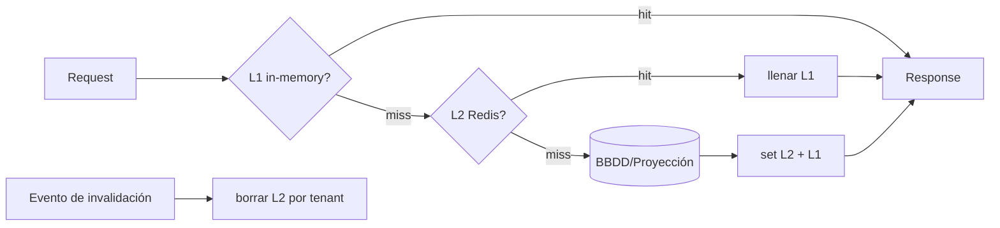

# 11 — Caché y Rendimiento

> Especificación original: **§9**. Decisiones: **ADR-0009** (caché multi-nivel L1/L2). Relacionado: `02` (tenant context), `03` (RBAC), `06` (dashboards de margen), `12` (observabilidad).

## 1. Topología multi-nivel

Se usan **dos niveles** con semántica distinta, gobernados por el contexto de tenant:

| Nivel | Tecnología | Contenido | TTL | Invalidación |
|---|---|---|---|---|
| **L1** (in-process) | Caché en memoria del proceso (p. ej. `cachetools`) | *Feature flags*, configuración de tenant, catálogos pequeños | Bajo (5–60 s) | TTL corto + refresco (eventual) |
| **L2** (distribuida) | **Redis/Valkey** | Sesiones, RBAC/permisos, snapshots de dashboards (margen), resultados costosos | Medio (60 s–10 min) | Por evento (invalidación dirigida) |



## 2. Políticas por tipo de dato

| Tipo de dato | Política | Motivo |
|---|---|---|
| *Feature flags* / config de tenant | **Cache-aside** L1 (TTL corto) | Lectura altísima, mutación rara; tolera unos segundos de eventualidad |
| Permisos RBAC (por usuario) | **Write-through** L2 al cambiar roles | Seguridad: la revocación debe ser efectiva rápido |
| Sesiones / tokens | **L2 only** (siempre Redis) | Compartido entre réplicas del backend; expiración por TTL del token |
| Snapshots de dashboards (margen, SLA) | **Cache-aside** L2 + invalidación por evento | Lecturas masivas; `TimeLogged` invalida el snapshot del proyecto |
| Catálogos (roles, tipos) | **L1** TTL medio | Cambian muy poco |

## 3. Claves y *namespacing* por tenant

Toda clave incluye `tenant_id` para garantizar aislamiento y permitir invalidación selectiva:

```
tenant:{tenant_id}:rbac:{user_id}            -> set de permisos (L2)
tenant:{tenant_id}:margin:{project_id}       -> snapshot margen (L2)
tenant:{tenant_id}:config                    -> config de tenant (L1)
tenant:{tenant_id}:flags                     -> feature flags (L1)
```

## 4. Cache-aside y write-through (referencia)

```python
# apps/backend/src/shared/cache/cache_aside.py
import json
from typing import Awaitable, Callable

class CacheAside:
    def __init__(self, redis, ttl_seconds: int):
        self._r = redis
        self._ttl = ttl_seconds

    async def get_or_set(self, key: str, loader: Callable[[], Awaitable[bytes]]) -> bytes:
        cached = await self._r.get(key)
        if cached is not None:
            return cached
        value = await loader()
        await self._r.set(key, value, ex=self._ttl)
        return value


# apps/backend/src/shared/cache/write_through.py
class WriteThrough:
    def __init__(self, redis, store):
        self._r = redis
        self._store = store  # repositorio persistente (BBDD)

    async def update_rbac(self, tenant_id: str, user_id: str, perms: set[str]) -> None:
        key = f"tenant:{tenant_id}:rbac:{user_id}"
        # 1) persistir (fuente de verdad)
        await self._store.save_permissions(tenant_id, user_id, perms)
        # 2) actualizar caché inmediatamente (write-through) + invalidar L1 por evento
        await self._r.set(key, json.dumps(sorted(perms)), ex=300)
        await self._r.publish(f"invalidate:tenant:{tenant_id}", "rbac")
```

## 5. Mitigación de *cache stampede*

Cuando una clave popular expira, cientos de requests la recalculan a la vez (*thundering herd*). Solución: **single-flight** con *lock* distribuido; solo un proceso recalcula y el resto esperan.

```python
# apps/backend/src/shared/cache/singleflight.py
import asyncio, uuid

class SingleFlight:
    def __init__(self, redis):
        self._r = redis

    async def get_or_compute(self, key: str, ttl: int, compute):
        token = uuid.uuid4().hex
        # intentar adquirir lock breve
        lock = await self._r.set(f"lock:{key}", token, nx=True, ex=10)
        if lock:
            try:
                value = await compute()
                await self._r.set(key, value, ex=ttl)
                return value
            finally:
                # liberar solo si es nuestro (Lua check-and-del)
                await self._r.eval(
                    "if redis.call('get',KEYS[1])==ARGV[1] then return redis.call('del',KEYS[1]) end",
                    1, f"lock:{key}", token)
        # esperar y re-leer
        await asyncio.sleep(0.05)
        return await self._r.get(key)
```

## 6. Mitigación de *cache avalanche*

Si muchas claves expiran a la vez (p. ej. tras un despliegue que calienta caché uniformemente), el backend satura la BBDD. Mitigaciones:

- **TTL *jittered*:** `ttl = base + random(0, jitter)` para desparramar expiraciones.
- **Warmup tras despliegue:** *job* que precarga las claves más calientes (dashboards de tenants activos) antes de recibir tráfico.
- **Circuit breaker / *degrade*:** si la BBDD falla, servir *stale* (con cabecera de staleness) en lugar de propagar el error.

```python
# apps/backend/src/shared/cache/ttl.py
import random

def jittered_ttl(base: int, jitter: int) -> int:
    return base + random.randint(0, max(jitter, 1))
```

## 7. Invalidación por tenant (basada en eventos)

La invalidación se dispara por **eventos de dominio** publicados en RabbitMQ; los consumidores borran las claves L2 afectadas y notifican a los procesos para limpiar L1 (vía Pub/Sub de Redis o *cache-buster*).

| Evento | Claves invalidadas |
|---|---|
| `rbac.changed` | `tenant:{t}:rbac:{user}` (+ L1 config/flags del usuario) |
| `fin.time_logged.recorded` | `tenant:{t}:margin:{project}` (snapshot de margen) |
| `tenant.config.updated` | `tenant:{t}:config`, `tenant:{t}:flags` (L1) |
| `tenant.branding.updated` | `tenant:{t}:branding` (tokens, `08`) |

```python
# apps/workers/src/subscribers/cache_invalidator.py
async def on_rbac_changed(msg):
    await redis.delete(f"tenant:{msg.tenant_id}:rbac:{msg.user_id}")
    await redis.publish(f"invalidate:tenant:{msg.tenant_id}", "rbac")
```

## 8. Coherencia con el contexto de tenant

El `TenantContext` (`02`) se propaga a la capa de caché: toda operación de caché deriva el prefijo `tenant:{id}` del contexto, evitando fugas cross-tenant incluso ante errores de programación (doble defensa con el RLS de BBDD).

## 9. Observabilidad de caché
Métricas clave (ver `12`): `cache.hit_ratio{level,kind}`, `cache.singleflight.waits`, `cache.invalidation.count{event}`, `redis.latency.p99`. Un *hit ratio* bajo en dashboards de margen indica que la invalidación es demasiado agresiva o el TTL muy corto — señales para afinar.
