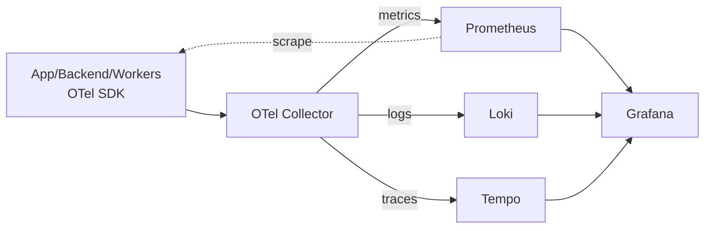

# 12 — Observabilidad y Telemetría

> Especificación original: **§10**. Decisiones: **ADR-0010** (OpenTelemetry → Prometheus + Loki + Tempo). Relacionado: `02` (tenant context), `05` (mensajería), `10` (infraestructura).

## 1. Los tres pilares + correlación

La observabilidad se basa en **OpenTelemetry (OTel)** como SDK neutro que emite los tres pilares a un *collector* central, el cual enruta a los *backends*:

| Pilar | Backend | Contenido |
|---|---|---|
| **Métricas** | **Prometheus** | Infra (CPU/mem/disco/cola) + negocio (ops financieras/seg por tenant, consumo VIP) |
| **Logs** | **Loki** (vía Promtail/OTel) | Logs JSON estructurados con `tenant_id`, `user_id`, `trace_id`, `tier_level` |
| **Trazas** | **Tempo** | Trazas HTTP/gRPC y a través del broker (productor→cola→consumidor) |
| **Visualización** | **Grafana** | Dashboards unificados; correlación métrica↔log↔traza por `trace_id` |

La correlación es la clave: un mismo `trace_id` (W3C Trace Context) recorre edge→API→broker→worker→BBDD, y aparece en logs y trazas.



## 2. Propagación W3C Trace Context

Toda solicitud entra con (o recibe) la cabecera `traceparent` (`00-<trace-id>-<span-id>-<flags>`). El middleware la extrae/crea, la asocia al *context* y la inyecta en **logs**, **events salientes** (cabeceras del broker) y **llamadas HTTP/gRPC salientes**.

```python
# apps/backend/src/shared/observability/middleware.py
import logging, contextvars
from dataclasses import dataclass
from fastapi import Request
from starlette.middleware.base import BaseHTTPMiddleware

trace_ctx: contextvars.ContextVar["TraceContext | None"] = contextvars.ContextVar(
    "trace_ctx", default=None)


@dataclass(frozen=True)
class TraceContext:
    trace_id: str
    span_id: str
    tenant_id: str | None
    tier_level: str | None


class W3CTracingMiddleware(BaseHTTPMiddleware):
    async def dispatch(self, request: Request, call_next):
        traceparent = request.headers.get("traceparent", "")
        trace_id, span_id = _parse_traceparent(traceparent)
        if not trace_id:
            trace_id, span_id = _new_ids()

        # tenant/tier resueltos por el TenantContextMiddleware (archivo 02)
        tenant = getattr(request.state, "tenant_ctx", None)
        trace_ctx.set(TraceContext(
            trace_id=trace_id,
            span_id=span_id,
            tenant_id=tenant.tenant_id if tenant else None,
            tier_level=tenant.tier if tenant else None,
        ))
        # propagar hacia servicios externos en la respuesta (para depuración)
        response = await call_next(request)
        response.headers["trace-id"] = trace_id
        return response


def _parse_traceparent(tp: str) -> tuple[str, str]:
    # formato: 00-<32 hex>-<16 hex>-<2 hex>
    parts = tp.split("-")
    if len(parts) == 4 and len(parts[1]) == 32 and len(parts[2]) == 16:
        return parts[1], parts[2]
    return "", ""


def _new_ids() -> tuple[str, str]:
    import secrets
    return secrets.token_hex(16), secrets.token_hex(8)
```

## 3. Logging estructurado con correlación

Los logs son **JSON** y siempre incluyen los identificadores de correlación, de modo que Grafana/Loki pueda saltar de una traza a sus logs y viceversa.

```python
# apps/backend/src/shared/observability/logging.py
import json, logging
from .middleware import trace_ctx


class JsonFormatter(logging.Formatter):
    def format(self, record: logging.LogRecord) -> str:
        ctx = trace_ctx.get()
        payload = {
            "ts": self.formatTime(record),
            "level": record.levelname,
            "logger": record.name,
            "msg": record.getMessage(),
            "trace_id": ctx.trace_id if ctx else None,
            "span_id": ctx.span_id if ctx else None,
            "tenant_id": ctx.tenant_id if ctx else None,
            "tier_level": ctx.tier_level if ctx else None,
        }
        if record.exc_info:
            payload["exception"] = self.formatException(record.exc_info)
        return json.dumps(payload, ensure_ascii=False)


def configure_logging(level: str = "INFO") -> None:
    handler = logging.StreamHandler()
    handler.setFormatter(JsonFormatter())
    root = logging.getLogger()
    root.handlers = [handler]
    root.setLevel(level)
```

> Promtail/OTel recoge estos logs y los envía a Loki; las etiquetas (`tenant_id`, `tier_level`) se indexan como *labels* para filtrado multi-tenant de bajo costo.

## 4. Métricas: infra y negocio

Además de las métricas estándar de infra (cAdvisor/node-exporter), se instrumentan **métricas de negocio** con etiquetas de tenant/tier, lo que habilita el *cost attribution* y la detección de *noisy neighbor* (`16`).

```python
# apps/backend/src/shared/observability/metrics.py
from prometheus_client import Counter, Histogram

# Negocio: operaciones financieras por segundo por tenant
FIN_OPS = Counter(
    "saas_financial_ops_total", "Operaciones financieras registradas",
    labelnames=("tenant_id", "tier", "kind"),
)
SLA_RISK = Counter(
    "saas_sla_risk_alerts_total", "Alertas de riesgo de SLA emitidas",
    labelnames=("tenant_id", "tier", "level"),
)
HTTP_LATENCY = Histogram(
    "saas_http_request_duration_seconds", "Latencia HTTP",
    labelnames=("route", "method", "status"),
    buckets=(0.05, 0.1, 0.25, 0.5, 1, 2.5, 5, 10),
)


def record_financial_op(tenant_id: str, tier: str, kind: str) -> None:
    FIN_OPS.labels(tenant_id=tenant_id, tier=tier, kind=kind).inc()
```

### Ejemplos de métricas clave
- `saas_financial_ops_total{tenant_id,tier,kind}` — throughput financiero por tenant (¿quién consume más?).
- `rabbitmq_queue_messages{queue}` — profundidad de cola (alimenta HPA de workers, `10`).
- `saas_http_request_duration_seconds` — latencia por ruta (SLO de API).
- `outbox_lag_seconds` — retardo del relay (salud del Outbox, `05`).
- `cache_hit_ratio{level,kind}` — salud de caché (`11`).

## 5. Trazas a través del broker

La traza **sobrevive al paso por la cola**: el publicador inyecta `traceparent` en los `headers` del mensaje; el consumidor (FastStream) lo extrae y continua el span. Esto permite ver la latencia total de un `TimeLogged` desde el webhook hasta la proyección de margen.

```python
# apps/backend/src/shared/observability/inject.py
from .middleware import trace_ctx

def inject_trace_headers(headers: dict) -> dict:
    ctx = trace_ctx.get()
    if ctx:
        headers["traceparent"] = f"00-{ctx.trace_id}-{ctx.span_id}-01"
        headers["tenant_id"] = ctx.tenant_id or ""
    return headers
```

```python
# apps/workers/src/shared/observability/extract.py
def extract_trace_headers(headers: dict) -> str | None:
    return headers.get("traceparent")  # el SDK OTel del worker continúa el span
```

## 6. SLOs y *service level objectives*

| Servicio | SLO | Alerta |
|---|---|---|
| API (p99 latencia GET) | < 300 ms | breach > 1 % en 5 min |
| Webhook Git → ledger | p95 < 10 s (VIP < 3 s) | cola `git.events` > umbral |
| Relay Outbox lag | < 5 s | `outbox_lag_seconds` > 30 |
| SLA risk eval | job completado cada N min | `sla.batch.lag` creciente |

Las alertas se definen en Prometheus/Alertmanager y se enrutan por severidad (`13` notifica, `07` define niveles de riesgo).

## 7. Retención y costo
- **Métricas:** retención 15 días alta resolución + *downsampling* (Recording rules) para 13 meses.
- **Logs:** particionado por tenant/tier; retención extendida (VIP 7 años) vía export del audit ledger (`03`).
- **Trazas:** muestreo (*sampling*) en el collector (p. ej. 10 % + 100 % de errores) para contener volumen.

La seguridad del stack (TLS interno, hardening, pipelines de imágenes) se trata en `13`.
