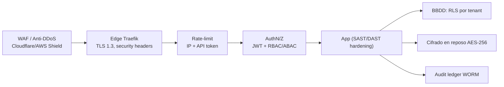

# 13 — Seguridad Aplicada y DevSecOps

> Especificación original: **§11**. Decisiones: **ADR-0013** (audit ledger/secretos), **ADR-0012** (MinIO WORM). Relacionado: `03` (identidad/RBAC), `10` (infraestructura), `12` (observabilidad).

## 1. Defensa en profundidad

La seguridad se aplica en **capas**; el compromiso de una capa no debe comprometer el sistema completo.



## 2. OWASP Top 10 — controles

| Riesgo OWASP | Control en esta plataforma |
|---|---|
| **A01 Broken Access Control** | RBAC/ABAC (`03`) + RLS por tenant (`02`) + tests de aislamiento cross-tenant en CI |
| **A02 Cryptographic Failures** | TLS 1.3 universal, AES-256 en reposo, JWT RS256 + rotación JWKS, secretos en Vault |
| **A03 Injection** | ORM parametrizado (SQLAlchemy), validación Pydantic v2, consultas sin *string concat* |
| **A04 Insecure Design** | Amenazas modeladas por *bounded context*; *threat modeling* en revisiones |
| **A05 Security Misconfiguration** | Hardening de imágenes (no-root), *network policies*, secretos fuera de imágenes |
| **A06 Vulnerable Components** | SCA: Snyk/Dependabot en CI, bloqueo de CVEs críticos |
| **A07 Auth Failures** | MFA obligatorio, *lockout* por intentos, rotación de *refresh tokens* (`03`) |
| **A08 Software/Data Integrity** | Firmas de imágenes (Cosign), *signed webhooks* (HMAC Git), audit ledger *tamper-evident* |
| **A09 Logging/Monitoring Failures** | OTel + Loki + alertas (`12`); audit ledger inmutable (`03`) |
| **A10 SSRF** | Validación/allowlist de egress; webhooks salientes solo a destinos permitidos |

## 3. Capa *edge* y *rate-limiting*

- **Anti-DDoS / WAF:** a nivel de CDN/cloud (Cloudflare o AWS Shield) antes de Traefik.
- **Security headers:** HSTS, CSP estricta, `X-Content-Type-Options`, `X-Frame-Options`/CSP `frame-ancestors`, `Referrer-Policy`.
- **Rate-limit** dual: por **IP** (anti-abuso genérico) y por **API token del tenant**, con **límites superiores para VIP** (materializa el tier también en cuotas).

```python
# apps/backend/src/shared/security/rate_limit.py
from dataclasses import dataclass
from fastapi import Request, HTTPException

@dataclass(frozen=True)
class Quota:
    requests: int
    window_seconds: int

# Límites por tier (token del tenant) — los VIP tienen cuota muy superior
TIER_QUOTA = {
    "starter": Quota(300, 60),
    "growth": Quota(600, 60),
    "enterprise": Quota(3000, 60),
    "vip": Quota(12000, 60),     # VIP: 20x starter
}
IP_QUOTA = Quota(120, 60)        # anti-abuso genérico por IP


async def enforce_rate_limit(request: Request, redis) -> None:
    tenant = getattr(request.state, "tenant_ctx", None)
    ip = request.client.host if request.client else "unknown"
    now_token = await _check(redis, f"rl:token:{tenant.tenant_id}",
                             TIER_QUOTA[tenant.tier]) if tenant else None
    await _check(redis, f"rl:ip:{ip}", IP_QUOTA)
    if now_token is False:
        raise HTTPException(429, "rate_limit.tier_exceeded")


async def _check(redis, key: str, quota: Quota) -> bool:
    count = await redis.incr(key)
    if count == 1:
        await redis.expire(key, quota.window_seconds)
    return count <= quota.requests
```

> La verificación por IP protege rutas públicas (landing/leads/login); la verificación por token protege la API autenticada. Los límites se ajustan y exponen como métricas (`12`).

## 4. Cifrado

| Superficie | Mecanismo |
|---|---|
| **En tránsito** | TLS 1.3 universal (edge + mTLS interno opcional en K8s); HSTS con *preload* |
| **En reposo (BBDD)** | AES-256 transparente (volúmenes cifrados / tablespace cifrado PG) |
| **En reposo (objetos)** | MinIO SSE-KMS (AES-256); backups cifrados |
| **Secretos** | Vault *Transit* (JWT), *dynamic DB credentials*; rotación automática |

## 5. Secret management

- Ningún secreto en imágenes ni repos. Inyección en runtime desde **Vault** (o AWS Secrets Manager).
- **Dynamic secrets** de BBDD: credenciales de corta duración por servicio, rotadas automáticamente.
- **Claves JWT** en Vault *Transit*; rotación programada con solapamiento de `kid` (`03`).

```hcl
# Ejemplo Vault policy para el backend (referencia)
path "database/creds/saas-backend" {
  capabilities = ["read"]   # dynamic DB creds, TTL corto
}
path "transit/sign/jwt-signer" {
  capabilities = ["update"]
}
path "transit/verify/jwt-signer" {
  capabilities = ["update"]
}
```

## 6. *Pipeline* DevSecOps

Cada PR pasa por etapas de seguridad **automatizadas** que bloquean el *merge* ante hallazgos críticos. Ilustración del *pipeline*:

```mermaid
flowchart LR
  PR[Pull Request] --> LINT[Lint/Format<br/>ruff, eslint]
  LINT --> SAST[SAST<br/>Semgrep + SonarQube]
  SAST --> SCA[SCA<br/>Snyk / Dependabot]
  SCA --> SECSEC[Secrets scan<br/>gitleaks]
  SECSEC --> BUILD[Build imágenes]
  BUILD --> IMG[Scan imágenes<br/>Trivy]
  IMG --> SIGN[Firma imágenes<br/>Cosign]
  SIGN --> DEPLOY_STG[Deploy staging]
  DEPLOY_STG --> DAST[DAST<br/>OWASP ZAP]
  DAST --> AUDIT_ISOL[Test aislamiento tenant]
  AUDIT_ISOL --> MERGE[Merge / deploy]
```



### Etapas del pipeline (referencia GitHub Actions)
```yaml
# .github/workflows/devsecops.yml (resumen de etapas)
name: devsecops
on: [pull_request]
jobs:
  static-analysis:
    runs-on: ubuntu-latest
    steps:
      - uses: actions/checkout@v4
      - uses: actions/setup-python@v5
        with: { python-version: "3.12" }
      - run: pip install ruff semgrep
      - run: ruff check .
      - run: semgrep ci --config p/owasp-top-ten --config p/python
      - uses: SonarSource/sonarqube-scan-action@v2
  dependencies:
    runs-on: ubuntu-latest
    steps:
      - uses: actions/checkout@v4
      - uses: snyk/actions/python@master
        with: { command: test --severity-threshold=high }
        env: { SNYK_TOKEN: "${{ secrets.SNYK_TOKEN }}" }
      - run: pip install pip-audit && pip-audit
  secrets-scan:
    runs-on: ubuntu-latest
    steps:
      - uses: actions/checkout@v4
        with: { fetch-depth: 0 }
      - uses: gitleaks/gitleaks-action@v2
  container-scan:
    needs: build
    runs-on: ubuntu-latest
    steps:
      - uses: aquasecurity/trivy-action@master
        with:
          image-ref: saas/backend:${{ github.sha }}
          severity: CRITICAL,HIGH
          exit-code: "1"
  dast:
    needs: deploy-staging
    runs-on: ubuntu-latest
    steps:
      - uses: zaproxy/action-baseline@v0.13.0
        with:
          target: https://staging.${{ vars.ROOT_DOMAIN }}
```

## 7. Pruebas de aislamiento multi-tenant (obligatorias)

Una **suite dedicada** verifica por cada endpoint autenticado que un token de tenant A **no** pueda leer ni mutar recursos de tenant B. Un fallo aquí bloquea el *merge*.

```python
# tests/isolation/test_cross_tenant.py
import pytest

@pytest.mark.parametrize("endpoint,method", [
    ("/projects", "GET"), ("/tasks", "GET"), ("/time-logs", "GET"),
])
async def test_cross_tenant_isolation(client, token_tenant_a, resource_in_tenant_b, endpoint, method):
    resp = await client.request(method, endpoint,
                                headers={"Authorization": f"Bearer {token_tenant_a}",
                                         "X-Tenant-Id": "tenant-a"})
    body = await resp.json()
    assert resp.status_code == 200
    assert not any(item.get("tenant_id") == "tenant-b" for item in body.get("items", []))
```

## 8. Hardening de imágenes

- Imágenes **no-root**, *distroless*/*slim*, multistage (`dockerfile-optimizer`), sin shell cuando es posible.
- *Read-only root filesystem* en K8s; *drop ALL* capabilities.
- Firmas **Cosign** + verificación en el *admission controller* (Solo imágenes firmadas despliegan).

## 9. Respuesta a incidentes
- Detección por alertas (`12`); auditoría inmutable (`03`) para *forensics*.
- *Runbooks* por severidad; rotación/revocación de credenciales (Vault) y *invalidación* de tokens (JWKS) como respuesta rápida.
- Postmortem sin culpa, registro en el audit ledger y mejora de controles.

La facturación que monetiza estos niveles de servicio (tiers VIP) se detalla en `14`.
