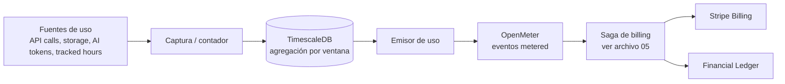

# 14 — Billing, Metering y Tiers

> Especificación original: **§4**. Decisiones: **ADR-0011** (OpenMeter + Stripe), **ADR-0007** (TimescaleDB), **ADR-0014** (VIP activation). Relacionado: `05` (Saga de billing), `06` (metering de horas), `01` (monetización).

## 1. Modelo de monetización

Híbrido: **tarifa base por tier + consumo medido por *meters***. La separación entre **metering** (qué se consumió) y **facturación** (qué se cobra) permite precisión, auditoría y alineación ingreso-costo.

```
Factura = tarifa_base(tier)  +  Σ ( consumo_meter × precio_meter )
```

- **Metering → OpenMeter:** captura, agrega por ventanas y emite eventos de uso.
- **Facturación → Stripe Billing:** genera la factura, cobra, gestiona *dunning* e impuestos.

## 2. Pipeline de metering



### Meters (catálogo de referencia)

> **Moneda:** todos los valores de este SAD se expresan en **pesos chilenos (CLP)**. Conversión de referencia: **1 USD ≈ 950 CLP**. Decimales con coma (convención CL).

| Meter | Unidad | Precio referencial (CLP) | Origen |
|---|---|---|---|
| `api.calls` | 1.000 requests | $95 | Edge/backend |
| `storage.gb` | GB·mes | $76 | MinIO/PG |
| `ai.tokens` | 1.000 tokens | $1,90 | Inferencia analítica (`07`) |
| `tracked.hours.vip` | hora | incluido / extra | Timer/Git (`06`) |
| `search.queries` | 1.000 queries | $475 | OpenSearch |

### Modelo de datos de metering (TimescaleDB)
```sql
CREATE TABLE usage_meters (
    id          BIGSERIAL,
    tenant_id   UUID NOT NULL,
    meter_code  TEXT NOT NULL,                  -- api.calls, ai.tokens...
    quantity    NUMERIC(18,4) NOT NULL,
    window_start TIMESTAMPTZ NOT NULL,
    window_end   TIMESTAMPTZ NOT NULL,
    recorded_at  TIMESTAMPTZ NOT NULL DEFAULT now(),
    PRIMARY KEY (id, recorded_at)
);
SELECT create_hypertable('usage_meters', 'recorded_at');
CREATE INDEX idx_usage_tenant_window ON usage_meters (tenant_id, meter_code, window_start DESC);

-- Agregado continuo: uso por tenant/meter/día
CREATE MATERIALIZED VIEW usage_daily
WITH (timescaledb.continuous) AS
SELECT
    time_bucket('1 day', window_start) AS day,
    tenant_id, meter_code,
    sum(quantity) AS total
FROM usage_meters
GROUP BY day, tenant_id, meter_code;
```

### Emisor de uso hacia OpenMeter (referencia)
```python
# apps/workers/src/billing/meter_emitter.py
from datetime import datetime, UTC

async def emit_usage(openmeter, tenant_id: str, meter_code: str, total: float, day):
    await openmeter.ingest_events(events=[{
        "specversion": "1.0",
        "type": "metered_usage",
        "source": "saas/finops",
        "subject": tenant_id,
        "time": datetime.now(UTC).isoformat(),
        "data": {
            "source": tenant_id,
            "meter": meter_code,            # ej: "api.calls"
            "value": float(total),
            "window": {"start": day.isoformat()},
        },
    }])
```

## 3. Integración OpenMeter + Stripe (ADR-0011)

- **OpenMeter** mantiene el *ledger* de metering y resuelve "cuánto consumió cada tenant en el periodo", con agregación por ventanas y deduplicación (idempotencia por `event_id`, `05`).
- **Stripe Billing** define el *plan* (tarifa base + *metered prices* atados a los meters de OpenMeter) y ejecuta el cobro, impuestos y *dunning*.
- La **Saga de billing** (`05`) orquesta el ciclo: `fetch usage → persist invoice (ES) → charge (Stripe) → settle/compensate`, persistiendo cada paso en el *Financial Ledger* para auditoría y para no duplicar cargos.

> **Justificación de la elección (OQ-1 resuelta):** OpenMeter aporta metering especializado (agregación bruta, eventos de uso, deduplicación) que Stripe por sí solo no cubre con la granularidad necesaria; Stripe aporta la madurez fiscal y de pagos que OpenMeter no provee. Se descartó "Stripe-only" (sin metering fino) y "Lago-only" (menos maduro en metering bruto).

## 4. Matriz de tiers

| Dimensión | Starter | Growth | Enterprise | VIP / Custom |
|---|---|---|---|---|
| **Tarifa base (ref.)** | $46.600/mes | $189.000/mes | $1.424.000/mes | A contrato |
| **Usuarios incluidos** | hasta 10 | hasta 50 | hasta 500 | ilimitado (acordado) |
| **Aislamiento de datos** | Shared schema (`tenant_id`) | Shared schema | Shared DB / *isolated schema* | **DB física dedicada** |
| **SLA** | mejor esfuerzo | 99,5 % | 99,9 % | **99,99 %** + penalty |
| **Soporte** | community | email | priority + TAM | **dedicado 24/7** |
| **Rate-limit API** | 300 req/min | 600 req/min | 3.000 req/min | **12.000 req/min** |
| **Retención audit/logs** | 1 año | 2 años | 3 años | **7 años (WORM)** |
| **Prioridad de colas** | estándar | estándar | alta | **prioritaria (x-max-priority=10)** |
| **Recursos VIP** | — | — | parcial | **completos** (ver §5) |

### Activación de recursos VIP (ADR-0014)

| Recurso VIP | Activación | Mecanismo |
|---|---|---|
| **DB aislada** | Aprovisionar StatefulSet + pool dedicado | Tenant Management → *provisioning* (`02`, `10`) |
| **Réplicas de lectura** | Crear read-replica; enrutar lecturas a réplica | Pool dinámico + *routing* lectura/escritura |
| **Workers exclusivos** | Servicio Swarm VIP dedicado + cola prioritaria | Swarm Placement Constraints + cola `*.vip` (`05`) |
| **IA prioritaria** | Inferencia analítica en cola VIP; mayor cómputo | `analytics.sla.vip` (`07`) |
| **Nodos dedicados** | Swarm Placement Constraints `workloadclass=vip` | `10` |
| **Retención logs extendida** | Política Loki por tier + export WORM MinIO | `12`, `03` |

> La activación se modela como un **evento de dominio** `tier.upgraded` que dispara un *tenant provisioning job* idempotente; el cambio de tier también orquesta la **migración de datos** correspondiente (`02`, §6).

## 5. Idempotencia y no duplicación de cargos
La integridad financiera descansa en: *Outbox* (no perder eventos), **idempotencia por `event_id`/`Idempotency-Key`** (no duplicar, `05`), y **Event Sourcing en el ledger** (auditoría completa). El *Financial Ledger* es la fuente de verdad para disputas y conciliación con Stripe.

## 6. Observabilidad del billing
Métricas (`12`): `billing.invoice.generated`, `billing.charge.outcome{ok,failed}`, `meter.usage.emitted{meter}`, `billing.dunning.retries`. El *cost attribution* que cierra el bucle FinOps del operador se trata en `16`.
