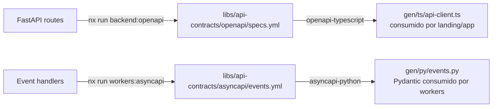

# 15 — Estructura del Monorepo (Nx)

> Especificación original: **§12**. Decisiones: **ADR-0004** (Nx + `@nxlv/python` + codegen). Relacionado: `09` (stack), `04` (dominio), `08` (frontend).

## 1. Principios del monorepo

- **Una sola fuente de verdad** para contratos, diseño y dominio; los cambios se propagan vía *codegen*.
- **Poliglotismo first-class:** Python (backend/workers) y TypeScript (frontend) conviven con tratamiento nativo en Nx mediante `@nxlv/python`.
- **Caché y *affected*:** Nx cachea tareas y permite operar solo sobre lo afectado por un cambio (`nx affected`), acelerando CI.
- **Límites de dependencia:** reglas `eslint`/Nx *boundaries* prohíben importar hacia atrás (un *lib* no depende de un *app*).

## 2. Árbol completo

```
saas-pm-finops/
├── apps/
│   ├── landing/                  # Next.js (SSG/ISR) — marketing + ROI + pricing
│   ├── app/                      # Next.js (SPA) — producto PM+FinOps
│   ├── backend/                  # FastAPI — API HTTP
│   └── workers/                  # FastStream — consumidores RabbitMQ
├── libs/
│   ├── design-system/            # shadcn/ui + componentes React (TS)
│   ├── ui-tokens/                # design tokens (JSON → CSS) (TS)
│   ├── ddd-core/                 # building blocks: AggregateRoot, ValueObject, Event (TS+PY)
│   ├── db-clients/               # SQLAlchemy async engines, session factory, RLS helpers (PY)
│   ├── security-utils/           # JWT/JWKS, HMAC verify, rate-limit, crypto (PY)
│   ├── api-contracts/            # OpenAPI (HTTP) + AsyncAPI (eventos) — ORIGEN
│   │   ├── openapi/              #   specs/*.yml  (generados desde FastAPI + mantenidos)
│   │   ├── asyncapi/             #   events/*.yml
│   │   └── gen/                  #   salida del codegen (TS clients, PY pydantic)
│   ├── billing-schemas/          # Pydantic: Invoice, UsageMeter, TierCatalog (PY)
│   └── financial-engine/         # dominio: ledger, contract, commands/queries (PY)
├── infra/
│   ├── docker/                   # docker-compose.yml, Dockerfiles
│   ├── postgres/ rabbitmq/ otel/ prometheus/ promtail/ tempo/
│   └── k8s/                      # manifests (Deployments, StatefulSets, HPA, affinities)
├── tools/
│   ├── codegen-openapi.ts        # genera clientes TS desde OpenAPI
│   └── codegen-asyncapi.ts       # genera Pydantic desde AsyncAPI
├── nx.json
├── package.json
├── pyproject.toml                # Poetry/uv workspace (root)
├── tsconfig.base.json
├── .github/workflows/            # CI/CD (DevSecOps, ver 13)
└── docs/architecture/            # este SAD
```

## 3. Configuración Nx + `@nxlv/python`

```jsonc
// nx.json (extracto)
{
  "$schema": "./node_modules/nx/schemas/nx-schema.json",
  "targetDefaults": {
    "lint":      { "cache": true, "inputs": ["default", "{workspaceRoot}/.eslintrc.json"] },
    "test":      { "cache": true },
    "build":     { "cache": true, "dependsOn": ["^build"] }
  },
  "plugins": [
    { "plugin": "@nxlv/python", "options": {
        "packageNameGenerator": "name-based",
        "projectType": "poetry",
        "pyprojectConfig": { "manageVscode": false }
    }},
    { "plugin": "@nx/next",  "options": { "buildTargetName": "build" } },
    { "plugin": "@nx/eslint/plugin" }
  ],
  "namedInputs": {
    "default": ["{projectRoot}/**/*", "sharedGlobals"],
    "sharedGlobals": ["{workspaceRoot}/tsconfig.base.json", "{workspaceRoot}/pyproject.toml"]
  }
}
```

```toml
# pyproject.toml (workspace root, Poetry/uv)
[tool.poetry]
name = "saas-pm-finops"
version = "0.1.0"
package-mode = false

[tool.poetry.dependencies]
python = "^3.12"
fastapi = "^0.115"
sqlalchemy = {version = "^2.0", extras = ["asyncio"]}
asyncpg = "^0.29"
alembic = "^1.13"
pydantic = "^2.9"
faststream = {version = "^0.5", extras = ["rabbit"]}
opentelemetry-sdk = "^1.28"

[tool.poetry.group.dev.dependencies]
ruff = "^0.6"
pytest = "^8.3"
mypy = "^1.11"
```

## 4. Flujo de codegen de contratos

Los **contratos son el origen**; backend y frontend los consumen como código generado y tipado. Esto elimina la deriva entre servicios (ADR-0004).



### Generación OpenAPI (TS clients)
```ts
// tools/codegen-openapi.ts (resumen)
import { generate } from 'openapi-typescript';

export default async function () {
  await generate(new URL('../libs/api-contracts/openapi/specs.yml', import.meta.url),
    { output: 'libs/api-contracts/gen/ts/api-client.ts' });
}
```

```jsonc
// libs/api-contracts/project.json
{
  "name": "api-contracts",
  "targets": {
    "gen-ts":  { "executor": "nx:run-commands",
                 "options": { "command": "tsx tools/codegen-openapi.ts" } },
    "gen-py":  { "executor": "nx:run-commands",
                 "options": { "command": "poetry run asyncapi generate models python libs/api-contracts/asyncapi/events.yml libs/api-contracts/gen/py" } },
    "verify":  { "executor": "nx:run-commands",
                 "options": { "command": "nx run-many -t gen-ts gen-py && git diff --exit-code libs/api-contracts/gen" } }
  }
}
```

> El *target* `verify` regenera los contratos y falla si hay *diff* sin *commit* — obliga a regenerar tras cambiar un contrato, evitando desincronía.

## 5. Project graph y límites

Nx construye el *graph* de dependencias a partir de imports; las *boundaries* de ESLint prohíben direcciones indebidas:

```jsonc
// .eslintrc.json (extracto boundaries)
"@nx/enforce-module-boundaries": ["error", {
  "allow": [],
  "depConstraints": [
    { "sourceTag": "type:app",       "onlyDependOnLibsWithTags": ["type:lib"] },
    { "sourceTag": "type:lib-domain","onlyDependOnLibsWithTags": ["type:lib-shared", "type:lib-domain"] },
    { "sourceTag": "type:lib-shared","onlyDependOnLibsWithTags": ["type:lib-shared"] }
  ]
}]
```

- `apps/*` solo dependen de `libs/*`.
- Los *libs* de dominio solo dependen de *shared* y de *ddd-core* ( Clean Arch: la dependencia apunta al dominio).
- Los contratos generados (`gen/`) son **solo lectura** (regla + CI).

## 6. CI/CD y tareas
- `nx run-many -t lint test build --affected` en PR (rápido por caché).
- *Pipeline* DevSecOps completo en `main`/release (ver `13`).
- Imágenes construidas por app (`landing`, `app`, `backend`, `workers`) y publicadas con *tag* `${git-sha}`; firma Cosign obligatoria.

## 7. Puente Nx↔Python (el detalle inusual del stack)
Nx es JS/TS-nativo; el backend es Python. `@nxlv/python` resuelve el puente:
- Cada proyecto Python se modela como *Nx project* con `project.json` y un `pyproject.toml` propio (workspace Poetry/uv).
- Nx invoca Poetry/uv para `lint`/`test`/`build` y los integra en la caché y en `nx affected`.
- Los contratos (OpenAPI/AsyncAPI) son el **punto de fricción controlado** entre ambos mundos: TS genera clientes; Python genera Pydantic; ambos desde los mismos YAML.

La evolución del monorepo y el plan por fases se detalla en `16`.
