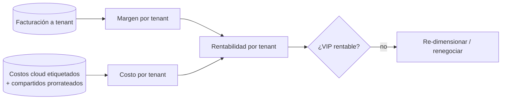
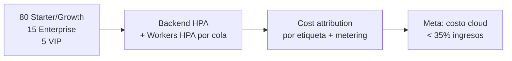

# 16 — Roadmap, FinOps de Plataforma y Riesgos

> Especificación original: **§13**. Relacionado: `10` (infraestructura), `14` (tiers), `01` (ROI), `12` (métricas).

## 1. Roadmap en 4 fases

| Fase | Objetivo | Alcance técnico | Entorno |
|---|---|---|---|
| **F1 — MVP** | Validar producto y landing | Landing SSG + ROI calculator + pricing; *core* PM (proyectos/tareas); timer/manual; auth + RBAC básico; FinOps mínimo (margen simple) | Docker Compose |
| **F2 — Multi-tenant estable + metering** | Cobrar por uso | Multi-tenancy híbrida (Starter/Growth shared, Enterprise schema); Outbox + eventos; webhook Git; metering (OpenMeter) + Stripe para Starter/Enterprise; observabilidad básica | Docker Compose + staging cloud |
| **F3 — Enterprise + VIP en K8s** | Aislamiento físico y escala | Migración a Kubernetes; **recursos VIP** (DB dedicada, workers exclusivos, Node Affinity, colas prioritarias, retención extendida); analítica predictiva de SLA; HPA por cola | Kubernetes (1 región) |
| **F4 — HA multi-región** | Resiliencia y SLA 99,99 % | Activa-pasiva multi-AZ/region; PITR y DR probados (game-days); DR RTO/RPO objetivos; *cost attribution* maduro | Kubernetes multi-región |

### Criterios de salida por fase (extracto)
- **F1:** conversión de landing medible; timer→margen funcional E2E.
- **F2:** primer cobro real por metering; suite de aislamiento multi-tenant verde.
- **F3:** tenants VIP con SLA 99,99 %; HPA de workers reacciona a picos de webhook.
- **F4:** *failover* ejecutado en < RTO objetivo en simulacro.

## 2. Tenant Cost Attribution (FinOps del operador)

El operador debe saber **cuánto cuesta servir a cada tenant** para proteger el margen (especialmente en VIP). El atributo combina:

1. **Etiquetado de recursos cloud** por tenant/tier (`tenant=vip-acme`, `tier=vip`): PV, load balancer, nodos dedicados, buckets WORM.
2. **Metering** del consumo compartido (CPU/memoria redimensionada, IOPS, almacenamiento) repartido por uso real.
3. **Imputación de dedicados** (100 % al tenant VIP que los posee).



### Cálculo de rentabilidad por tenant (referencia)
```python
# apps/analytics/src/cost_attribution.py
from decimal import Decimal

def tenant_profitability(revenue: dict, costs: dict, tenant_id: str) -> dict:
    rev = Decimal(str(revenue.get(tenant_id, 0)))             # facturado (Stripe)
    dedicated = Decimal(str(costs["dedicated"].get(tenant_id, 0)))   # 100% VIP
    shared = Decimal(str(costs["shared_prorated"].get(tenant_id, 0)))# por uso
    total_cost = dedicated + shared
    margin_pct = ((rev - total_cost) / rev * 100) if rev > 0 else Decimal("0")
    return {"tenant_id": tenant_id, "revenue": rev, "cost": total_cost,
            "margin_pct": round(margin_pct, 2), "is_vip": dedicated > 0}
```

> Esta misma señal dispara **acciones**: re-dimensionar recursos VIP, ajustar pricing o renegociar contratos no rentables. Cierra el bucle FinOps entre el cliente (su margen) y el operador (el nuestro).

## 3. Proyección FinOps: 100 tenants mixtos / 5.000 usuarios

Supuestos de **diseño** (referencia, no compromisos comerciales):

| Dimensión | Valor referencia | Implicación de capacidad |
|---|---|---|
| Tenants totales | 100 (mixto) | ~80 Starter/Growth, ~15 Enterprise, ~5 VIP |
| Usuarios concurrentes | 5.000 (pico) | HPA backend; sesiones en Redis |
| API throughput | ~10.000 req/s pico | Rate-limit por tier (`13`); caché L1/L2 (`11`) |
| Eventos `TimeLogged` | ~2.000/s en pico de *merge* | Cola RabbitMQ + workers escalables; Outbox |
| Dashboards margen | ~1.000 lecturas/s | Proyecciones CQRS (TimescaleDB) + caché L2 |
| Datos time-series | ~50 M filas/mes | Hypertables + *continuous aggregates* |
| Costo cloud mensual | objetivo: < 35 % de ingresos (F3) | Cost attribution continuo |



> Los VIP, aunque pocos, concentran costo (recursos dedicados) **e** ingreso (tarifa a contrato); el cost attribution es lo que asegura que cada VIP sea rentable y no un sumidero.

## 4. Top-4 riesgos técnicos y mitigación

### R-1 — Consistencia eventual en finanzas
- **Riesgo:** las proyecciones (margen/SLA) pueden desfasarse del ledger; mostrar un margen incorrecto erosiona confianza y, en billing, equivale a error de cobro.
- **Mitigación:** Event Sourcing en ledgers (fuente de verdad), idempotencia estricta (`05`), *reconciliation job* periódico que recomputa proyecciones desde eventos, y *healthcheck* de lag del Outbox/proyección (`12`). En billing, la Saga persiste cada paso y nunca cobra dos veces (idempotencia).

### R-2 — Fuga de aislamiento multi-tenant
- **Riesgo:** un bug en filtrado expone datos de tenant B a tenant A (catastrófico para confianza y cumplimiento).
- **Mitigación:** defensa en profundidad — filtro de app **+ RLS de PostgreSQL** (`02`), `TenantContext` propagado por `contextvars`, y **suite obligatoria de aislamiento cross-tenant en CI** (`13`). Tests de mutación sobre endpoints sensibles.

### R-3 — Precisión del metering VIP
- **Riesgo:** medir mal el uso (pérdida/duplicación) degrada la confianza y el ingreso, sobre todo en VIP con volúmenes altos.
- **Mitigación:** metering en TimescaleDB con *continuous aggregates*, **idempotencia por `event_id`** (no duplicar), reconciliación OpenMeter↔ledger, y auditoría del metering como *ledger* (ES). Alarmas de desviación entre lo medido y lo facturado.

### R-4 — Adopción y rendimiento de la landing
- **Riesgo:** si la landing no convierte o es lenta, todo el embudo se debilita (Core Web Vitals pobres = menos conversión y SEO).
- **Mitigación:** SSG/ISR para LCP<2.5 s, A/B testing de secciones, medición continua de conversión y *web vitals* como métricas de producto (`12`); ROI calculator que cuantifica valor en la primera visita (`08`).

## 5. Riesgos no técnicos (resumen)
- **Dependencia de proveedores externos** (Stripe, GitHub/GitLab, IdP): diseñar con *fallback* y abstracción (contratos) para no acoplarse irreversiblemente.
- **Cumplimiento regulatorio evolutivo** (SOC2/GDPR por jurisdicción): mantener el audit ledger WORM y la trazabilidad como base reutilizable.

## 6. Definición de "Done" de la plataforma (criterio de aceptación global)
- 14 secciones del SAD implementadas y coherentes (este documento es su referencia).
- Aislamiento multi-tenant probado; metering reconciliado con facturación; SLA VIP cumplido; DR probado en simulacro; cost attribution operativo y dentro del objetivo de margen.

Las decisiones que sustentan cada mitigación están consolidadas en `ADR-Records.md`.
